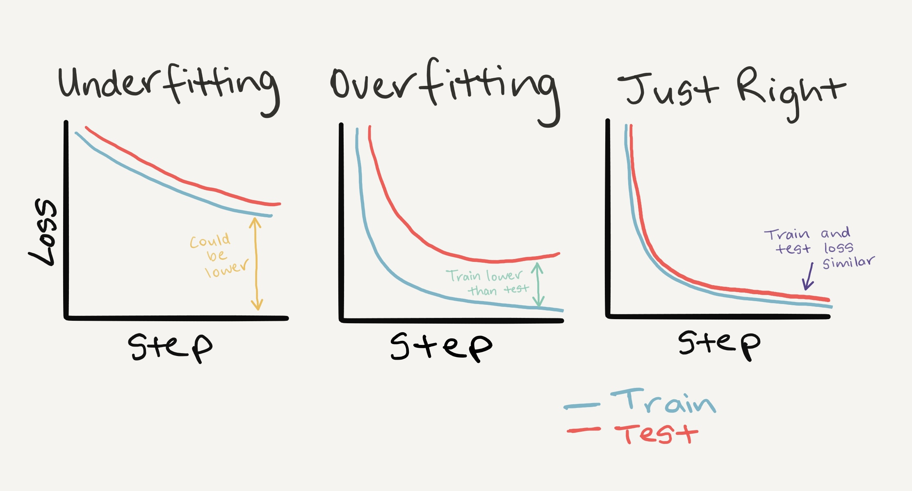

## ML pipeline:
1. import data
2. clean data, preprocessing. For example: handle missing data(throw away, replace...)
3. normalize data
4. learm machine. For example: create neural network and feed training data set
5. tune(regularization)
6. test result with control data set

## Tensor

Tensors are the fundamental building block of machine learning.

Their job is to represent data in a numerical way.

In mathematics, a tensor is an algebraic object that describes a multilinear relationship between sets of algebraic objects related to a vector space. Tensors may map between different objects such as vectors, scalars, and even other tensors. There are many types of tensors.

Is a multi-dimensional matrix containing elements.

### Image representation example

Its possible to represent an image as a tensor with shape `[3, 224, 224]` which would mean `[colour_channels, height, width]`, as in the image has 3 colour channels (red, green, blue), a height of 224 pixels and a width of 224 pixels. In tensor-speak (the language used to describe tensors), the tensor would have three dimensions, one for colour_channels, height and width.

https://www.learnpytorch.io/00_pytorch_fundamentals/#introduction-to-tensors

https://en.wikipedia.org/wiki/Tensor

## Train model
The process of training an ML model involves providing an ML algorithm (that is, the learning algorithm) with training data to learn from. The term ML model refers to the model artifact that is created by the training process. 

The learning algorithm finds patterns in the training data that map the input data attributes to the target (the answer that you want to predict), and it outputs an ML model that captures these patterns. 

### Hyperparameter

In machine learning, a hyperparameter is a parameter, such as the learning rate or choice of optimizer, which specifies details of the learning process, hence the name hyperparameter. This is in contrast to parameters which determine the model itself. 

https://en.wikipedia.org/wiki/Hyperparameter_(machine_learning)

### Loss function
At its core, a loss function is incredibly simple: It's a method of evaluating how well your algorithm models your dataset. If your predictions are totally off, your loss function will output a higher number. If they're pretty good, it'll output a lower number.

**Interpreting Loss Curves**: https://developers.google.com/machine-learning/testing-debugging/metrics/interpretic

https://en.wikipedia.org/wiki/Loss_function

### Optimizer

Tells your model how to update its internal parameters to best lower the loss.

https://www.learnpytorch.io/01_pytorch_workflow/

### How to pick loss/optimizer function?

Table of various loss functions and optimizers, there are more but these some common ones:

https://pytorch.org/docs/stable/nn.html#loss-functions

https://pytorch.org/docs/stable/optim.html

#### learning rate

lr is the learning rate you'd like the optimizer to update the parameters at, higher means the optimizer will try larger updates (these can sometimes be too large and the optimizer will fail to work), lower means the optimizer will try smaller updates (these can sometimes be too small and the optimizer will take too long to find the ideal values). The learning rate is considered a hyperparameter (because it's set by a machine learning engineer). Common starting values for the learning rate are 0.01, 0.001, 0.0001, however, these can also be adjusted over time

## Algorithms

### KNN algorithm

The k-nearest neighbors (KNN) algorithm is a non-parametric, supervised learning classifier, which uses proximity to make classifications or predictions about the grouping of an individual data point. It is one of the popular and simplest classification and regression classifiers used in machine learning today.

While there are several distance measures that you can choose from, this article will only cover the following:

- **Euclidean distance** (p=2): This is the most commonly used distance measure, and it is limited to real-valued vectors. Using the below formula, it measures a straight line between the query point and the other point being measured.

- **Manhattan distance** (p=1): This is also another popular distance metric, which measures the absolute value between two points. It is also referred to as taxicab distance or city block distance as it is commonly visualized with a grid, illustrating how one might navigate from one address to another via city streets.

- **Minkowski distance** : This distance measure is the generalized form of Euclidean and Manhattan distance metrics. The parameter, p, in the formula below, allows for the creation of other distance metrics. Euclidean distance is represented by this formula when p is equal to two, and Manhattan distance is denoted with p equal to one.

- **Hamming distance** : This technique is used typically used with Boolean or string vectors, identifying the points where the vectors do not match. As a result, it has also been referred to as the overlap metric. This can be represented with the following formula:

https://www.ibm.com/topics/knn

### k-means clustering

K-means is an unsupervised learning method for clustering data points. The algorithm iteratively divides data points into K clusters by minimizing the variance in each cluster.

https://www.w3schools.com/python/python_ml_k-means.asp

https://en.wikipedia.org/wiki/K-means_clustering

### Hotspots

### Random Cut Forest

### Reinforcement learning

Range of techniques based on expierience. In its most general form a reinforcement learning algorithm has three components:

- an exploration strategy for trying different actions
- reinforcement function that gives feedback on how good each action is
- learning rule that links two above together

Reinforcement learning deals with a unique problem setup where an arbitrary agent is trying to learn the optimal way of interacting with an environment. In return for its actions, it receives rewards; the agent’s goal is to find an optimal policy that maximizes cumulative numerical return.

https://en.wikipedia.org/wiki/Reinforcement_learning

#### Q learning

Q-learning is a model-free reinforcement learning algorithm to learn the value of an action in a particular state. It does not require a model of the environment (hence "model-free"), and it can handle problems with stochastic transitions and rewards without requiring adaptations.

For any finite Markov decision process (FMDP), Q-learning finds an optimal policy in the sense of maximizing the expected value of the total reward over any and all successive steps, starting from the current state. Q-learning can identify an optimal action-selection policy for any given FMDP, given infinite exploration time and a partly-random policy. "Q" refers to the function that the algorithm computes – the expected rewards for an action taken in a given state.

Fits for state machines, decision trees.

### Neural networks

is a model inspired by the structure and function of biological neural networks in animal brains.

An ANN consists of connected units or nodes called artificial neurons, which loosely model the neurons in a brain. These are connected by edges, which model the synapses in a brain. Each artificial neuron receives signals from connected neurons, then processes them and sends a signal to other connected neurons. The "signal" is a real number, and the output of each neuron is computed by some non-linear function of the sum of its inputs, called the activation function. The strength of the signal at each connection is determined by a weight, which adjusts during the learning process. 

Exemples of NN topography

An **activation function** in the context of neural networks is a mathematical function applied to the output of a neuron. The purpose of an activation function is to introduce non-linearity into the model, allowing the network to learn and represent complex patterns in the data. Without non-linearity, a neural network would essentially behave like a linear regression model, regardless of the number of layers it has.

The activation function decides whether a neuron should be activated or not by calculating the weighted sum and further adding bias to it. The purpose of the activation function is to introduce non-linearity into the output of a neuron. 

- https://www.geeksforgeeks.org/activation-functions-neural-networks/
- https://en.wikipedia.org/wiki/Activation_function
- https://towardsdatascience.com/the-mostly-complete-chart-of-neural-networks-explained-3fb6f2367464
- https://github.com/isidzukuri/nn_discovery

#### Raw logits -> Predictions probabilities -> Predictions labels

model outputs are going to be **logits**

**logits** can be converted into **prediction_probabilities** by passing them to activation function

Then **prediction_probabilities** can be converted to **prediction_labels**

#### Softmax

Recall that logistic regression produces a decimal between 0 and 1.0. For example, a logistic regression output of 0.8 from an email classifier suggests an 80% chance of an email being spam and a 20% chance of it being not spam. Clearly, the sum of the probabilities of an email being either spam or not spam is 1.0.

Softmax extends this idea into a multi-class world. That is, Softmax assigns decimal probabilities to each class in a multi-class problem. Those decimal probabilities must add up to 1.0. This additional constraint helps training converge more quickly than it otherwise would.

https://developers.google.com/machine-learning/crash-course/multi-class-neural-networks/softmax

#### Gradient Descent

Gradient Descent stands as a cornerstone orchestrating the intricate dance of model optimization. At its core, it is a numerical optimization algorithm that aims to find the optimal parameters—weights and biases—of a neural network by minimizing a defined cost function.

Gradient Descent (GD) is a widely used optimization algorithm in machine learning and deep learning that minimises the cost function of a neural network model during training. It works by iteratively adjusting the weights or parameters of the model in the direction of the negative gradient of the cost function until the minimum of the cost function is reached.

The learning happens during the backpropagation while training the neural network-based model. There is a term known as Gradient Descent, which is used to optimize the weight and biases based on the cost function. The cost function evaluates the difference between the actual and predicted outputs.

https://www.geeksforgeeks.org/gradient-descent-algorithm-and-its-variants/

#### Backpropagation

The algorithm is used to effectively train a neural network through a method called chain rule. In simple terms, after each forward pass through a network, backpropagation performs a backward pass while adjusting the model’s parameters (weights and biases).

Backpropagation is a gradient estimation method used to train neural network models. The gradient estimate is used by the optimization algorithm to compute the network parameter updates. 

https://en.wikipedia.org/wiki/Backpropagation

#### Convolutional neural networks (CNN)
is the extended version of artificial neural networks (ANN) which is predominantly used to extract the feature from the grid-like matrix dataset. For example visual datasets like images or videos where data patterns play an extensive role.

Practical Applications of CNNs:
- Image classification
- Object detection
- Facial recognition
- Optical flow (task of predicting movement between two images)

**CNN explainer** https://poloclub.github.io/cnn-explainer/

#### Optical Flow

Optical flow is the task of predicting movement between two images, usually two consecutive frames of a video. Optical flow models take two images as input, and predict a flow: the flow indicates the displacement of every single pixel in the first image, and maps it to its corresponding pixel in the second image. 

https://www.youtube.com/watch?v=YRhxdVk_sIs

https://www.datacamp.com/tutorial/introduction-to-convolutional-neural-networks-cnns

https://www.geeksforgeeks.org/introduction-convolution-neural-network/

#### Transfer learning
Transferring information from one machine learning task to another. 

Transfer learning allows us to take the patterns (also called weights) another model has learned from another problem and use them for our own problem.

Options:

- use pretrained model as it is

- use pretrained model and weights on different training dataset + adding/editing some layers

Input data should go thru the same transformations as for original model.

The process of transfer learning usually goes: freeze some base layers of a pretrained model (typically the `features` section) and then adjust the output layers (also called `head/classifier` layers) to suit your needs.

https://www.learnpytorch.io/06_pytorch_transfer_learning/

#### Which pretrained model should be chosen
It depends on your problem/the device you're working with.

Generally, the higher number in the model name (e.g. efficientnet_b0() -> efficientnet_b1() -> efficientnet_b7()) means better performance but a larger model.

You might think better performance is always better, right?

That's true but some better performing models are too big for some devices.

For example, say you'd like to run your model on a mobile-device, you'll have to take into account the limited compute resources on the device, thus you'd be looking for a smaller model.

But if you've got unlimited compute power, as The Bitter Lesson states, you'd likely take the biggest, most compute hungry model you can.

Understanding this performance vs. speed vs. size tradeoff will come with time and practice.

### More algorithms

- AWS built-in algorithms or pretrained models: https://docs.aws.amazon.com/sagemaker/latest/dg/algos.html

- https://scikit-learn.org/stable/user_guide.html

### machine learning components 

https://paperswithcode.com/methods

### Binary classification 
is the task of classifying the elements of a set into one of two groups (each called class).
Some of the methods commonly used for binary classification are:

- Decision trees
- Random forests
- Bayesian networks
- Support vector machines
- Neural networks
- Logistic regression
- Probit model
- Genetic Programming
- Multi expression programming
- Linear genetic programming 

https://en.wikipedia.org/wiki/Binary_classification

### Multiclass classification
is the problem of classifying instances into one of three or more classes

Several algorithms have been developed based on: 
- neural networks
- decision trees
- k-nearest neighbors
- naive Bayes
- support vector machines 
- extreme learning machines 

https://en.wikipedia.org/wiki/Multiclass_classification

### Multi-label classification
Target can be assigned more than one option

## Regularization

 is a set of methods for reducing overfitting in machine learning models. Typically, regularization trades a marginal decrease in training accuracy for an increase in generalizability.
 

https://www.ibm.com/topics/regularization

https://www.geeksforgeeks.org/regularization-in-machine-learning/

The commonly used regularization with linear models techniques are: 

- Lasso Regularization – L1 Regularization
- Ridge Regularization – L2 Regularization
- Elastic Net Regularization – L1 and L2 Regularization

### Types of regularization in machine learning 
#### Dataset

- **Data augmentation** is a regularization technique that modifies model training data. It expands the size of the training set by creating artificial data samples derived from pre-existing training data. Adding more samples to the training set, particularly of instances rare in real world data, exposes a model to a greater quantity and diversity of data from which it learns. 

https://pytorch.org/blog/how-to-train-state-of-the-art-models-using-torchvision-latest-primitives/

#### Model training

- **Early stopping** is perhaps the most readily implemented regularization technique. In short, it limits the number of iterations during model training. Here, a model continuously passes through the training data, stopping once there is no improvement (and perhaps even deterioration) in training and validation accuracy. The goal is to train a model until it has reached the lowest possible training error preceding a plateau or increase in validation error.

#### Neural networks 
- **Dropout** regularizes neural networks by randomly dropping out nodes, along with their input and output connections, from the network during training. Dropout trains several variations of a fixed-sized architecture, with each variation having different randomized nodes left out of the architecture.
- **Weight decay**

## Confusion matrix

## Performance Metrics in Machine Learning

There are at least  7 different categories and types of metrics used to measure machine learning performance, including: 

1. Classification Metrics

- Accuracy
- Precision
- Recall
- Logarithmic Loss
- F1-Score
- Receiver Operating Characteristic  
- Area Under Curve

2. Regression Metrics

- Mean Squared Error
- Mean Absolute Error

3. Ranking Metrics

- Mean Reciprocal Rate
- Discounted Cumulative Gain
- Non-Discounted Cumulative Gain

4. Statistical Metrics

- Correlation

5. Computer Vision Metrics

- Peak Signal-to-Noise
- Structural Similarity Index
- Intersection over Union

6. Natural Language Processing Metrics

- Perplexity
- Bilingual Evaluation Understudy Score

7. Deep Learning Related Metrics

- Inception Score
- Frechet Inception Distance

#### Accuracy

#### Precision

What proportion of positive identifications was actually correct

#### Recall

What proportion of actual positives was identified correctly

\* The **tradeoff between precision and recall** occurs because increasing the threshold for classification will result in fewer false positives (increasing precision) but also more false negatives (decreasing recall), and vice versa.

#### F1 score

The range for F1 scores is between 0 and 1, with one being the absolute best score possible. Naturally then, the higher the F1 score, the better, with a poor score denoting both low precision and low recall. As your recall and precision scores increase, your F1 score will also increase. That means if you find  your F1 score is low, a good place to start looking for solutions is within your precision or recall metrics.  

https://www.v7labs.com/blog/performance-metrics-in-machine-learning

https://www.aiacceleratorinstitute.com/evaluating-machine-learning-models-metrics-and-techniques/

https://developers.google.com/machine-learning/crash-course/classification/precision-and-recall

## Ensemble methods

In statistics and machine learning, ensemble methods use multiple learning algorithms to obtain better predictive performance than could be obtained from any of the constituent learning algorithms alone.

Ensemble means ‘a collection of things’ and in Machine Learning terminology, Ensemble learning refers to the approach of combining multiple ML models to produce a more accurate and robust prediction compared to any individual model. It implements an ensemble of fast algorithms (classifiers) such as decision trees for learning and allows them to vote.

There are many types of ensembles. For example:

https://en.wikipedia.org/wiki/Ensemble_learning

https://www.geeksforgeeks.org/a-comprehensive-guide-to-ensemble-learning/

## ML infrastructure

Examples:

## ML lifecycle

Example:

## Running ML on edge an mobile devices

On-device machine learning is a paradigm shift from traditional cloud-based ML. It allows:

- Direct Processing: ML tasks are performed directly on the device, such as smartphones or tablets.
- Independence from the Cloud: It operates without the need for a constant connection to the cloud.
- Local Data Processing: Data is processed locally, ensuring faster response times and immediate inference. Inference, in this context, refers to the process of applying a trained machine learning model to make predictions or draw conclusions from input data.

When planning the implementation on mobile devices, there are several considerations to keep in mind:

- Data Pre and Post-processing: On the web, we often perform data pre and post-processing using libraries like OpenCV and NumPy. However, these libraries may not be directly available in the mobile framework, so alternative approaches or libraries may be needed.
- Choice of Language: The programming language used for web scripts becomes important, as not all web libraries and frameworks are easily transferrable to mobile platforms.
- Accuracy vs. Constraints: It’s essential to define the desired accuracy for your mobile model and consider any time constraints. Smaller models are often preferred on mobile devices due to factors like app size and processing speed, but this may result in a drop in accuracy.
- Memory Management: Unlike web devices, mobile devices have more limited memory resources. Larger model sizes and complex computational code can lead to memory-related issues and even cause the mobile app to crash.

There are various tools and frameworks that can help us add on-device ML. 

For Android app:

- ML Kit: A Google SDK that provides ready-to-use ML models and APIs for common tasks such as barcode scanning, text recognition, face detection, pose detection, etc. The ML Kit also supports custom TensorFlow Lite models and AutoML Vision Edge models.
- MediaPipe: A Google framework that enables building custom ML pipelines using pre-built components such as graphs, calculators, models, etc. MediaPipe also provides ready-to-use solutions for common tasks such as face mesh detection, hand tracking, object detection, etc.
- TFLite: A Google library that allows running TensorFlow models on mobile devices with low latency and a small binary size. TFLite also supports hardware acceleration, model optimization, and metadata extraction.

For IOS devices:

- Create ML
- Core ML

https://gursimarsm.medium.com/how-to-add-machine-learning-to-an-android-app-5bb8c6c185ef

https://medium.com/eumentis/how-we-navigated-running-machine-learning-models-on-edge-device-7c67b1ff1b97

**Amazon SageMaker Neo**  

provides compilation support for popular machine learning frameworks. You can deploy your Neo-compiled edge devices such as the Raspberry Pi 3, Texas Instruments' Sitara, Jetson TX1, and more.

Automatically optimizes machine learning models for inference on cloud instances and edge devices to run faster with no loss in accuracy. You start with a machine learning model already built with DarkNet, Keras, MXNet, PyTorch, TensorFlow, TensorFlow-Lite, ONNX, or XGBoost and trained in Amazon SageMaker or anywhere else. Then you choose your target hardware platform, which can be a SageMaker hosting instance or an edge device based on processors from Ambarella, Apple, ARM, Intel, MediaTek, Nvidia, NXP, Qualcomm, RockChip, or Texas Instruments. With a single click, SageMaker Neo optimizes the trained model and compiles it into an executable. 

https://aws.amazon.com/sagemaker/neo/

https://docs.aws.amazon.com/sagemaker/latest/dg/neo-edge-devices.html

## Frameworks

**pytorch** vs **tensorflow** https://www.upwork.com/resources/pytorch-vs-tensorflow

https://mljourney.com/comparison-of-popular-machine-learning-frameworks/

https://en.wikipedia.org/wiki/Comparison_of_deep_learning_software

## Python ecosystem

**NumPy** -  a library for the Python programming language, adding support for large, multi-dimensional arrays and matrices, along with a large collection of high-level mathematical functions to operate on these arrays.

**Matplotlib** is a comprehensive library for creating static, animated, and interactive visualizations in Python. Matplotlib makes easy things easy and hard things possible. 

**Pandas** is a fast, powerful, flexible and easy to use open source data analysis and manipulation tool

**scikit-learn** - Simple and efficient tools for predictive data analysis. Collection of algorithms. Open-source machine learning library. It features various classification, regression and clustering algorithms including support-vector machines, random forests, gradient boosting, k-means and DBSCAN, and is designed to interoperate with the Python numerical and scientific libraries NumPy and SciPy. Collection of toy datasets generation methods.

**TorchMetricks**  is a collection of 100+ PyTorch metrics implementations and an easy-to-use API to create custom metrics. https://lightning.ai/docs/torchmetrics/stable/

**torchinfo** provides information complementary to what is provided by `print(your_model)` in PyTorch. It prints topology of model, summary, etc https://github.com/TylerYep/torchinfo

**TensorBoard** provides the visualization and tooling needed for machine learning experimentation. Experiment tracking, performance plots, etc. https://www.tensorflow.org/tensorboard

## Useful links

Machine Learning Glossary:

- https://developers.google.com/machine-learning/glossary

Datasets, models:

- https://github.com/huggingface/pytorch-image-models

- https://huggingface.co/

- https://www.kaggle.com/

- https://paperswithcode.com/sota

- https://github.com/satellite-image-deep-learning [topological, satelite images]

- https://en.wikipedia.org/wiki/MNIST_database [images]

- https://github.com/zalandoresearch/fashion-mnist [images]

- https://www.image-net.org/ [images]

Courses:
 
- https://www.udemy.com/course/aws-machine-learning/

- https://www.udemy.com/course/pytorch-for-deep-learning/

- https://www.learnpytorch.io/

Lectures:

- https://www.youtube.com/watch?v=ErnWZxJovaM&list=PLtBw6njQRU-rwp5__7C0oIVt26ZgjG9NI&index=1

Articles:

- https://arxiv.org/

Online NN builder:

- https://playground.tensorflow.org/

Performance:

- https://horace.io/brrr_intro.html