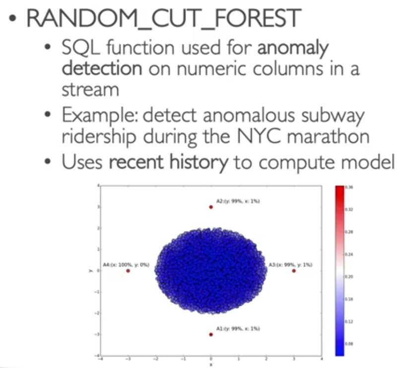
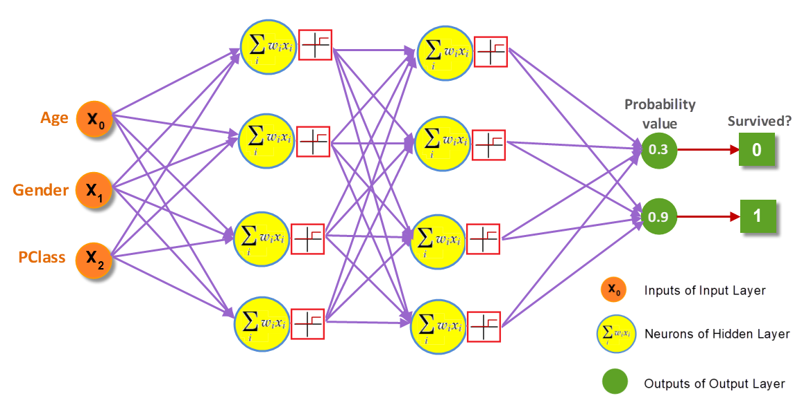
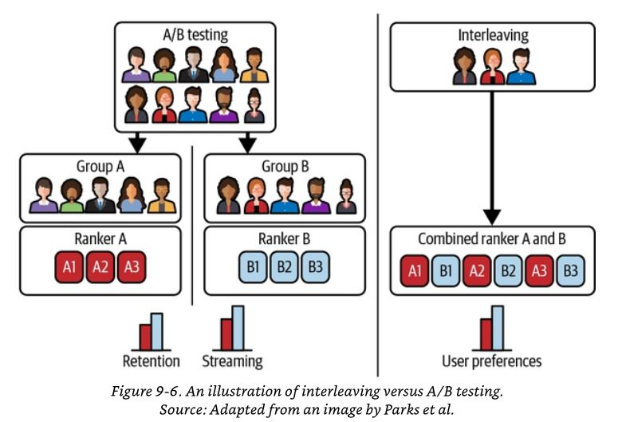
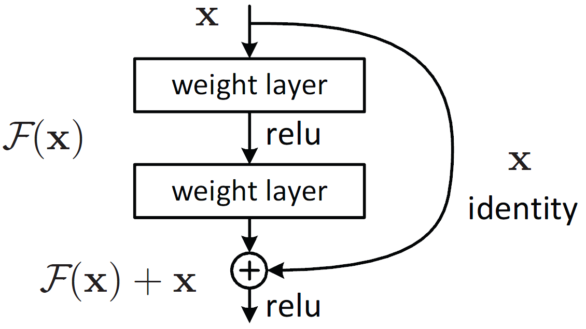

## ML pipeline:
1. import data
2. clean data, preprocessing. For example: handle missing data(throw away, replace...)
3. normalize data
4. learm machine. For example: create neural network and feed training data set
5. tune(regularization)
6. test result with control data set


## Tensor


Tensors are the fundamental building block of machine learning.

Their job is to represent data in a numerical way.

In mathematics, a tensor is an algebraic object that describes a multilinear relationship between sets of algebraic objects related to a vector space. Tensors may map between different objects such as vectors, scalars, and even other tensors. There are many types of tensors.

Is a multi-dimensional matrix containing elements.


### Image representation example

Its possible to represent an image as a tensor with shape `[3, 224, 224]` which would mean `[colour_channels, height, width]`, as in the image has 3 colour channels (red, green, blue), a height of 224 pixels and a width of 224 pixels. In tensor-speak (the language used to describe tensors), the tensor would have three dimensions, one for colour_channels, height and width.


https://www.learnpytorch.io/00_pytorch_fundamentals/#introduction-to-tensors

https://en.wikipedia.org/wiki/Tensor


## Train model
The process of training an ML model involves providing an ML algorithm (that is, the learning algorithm) with training data to learn from. The term ML model refers to the model artifact that is created by the training process. 

The learning algorithm finds patterns in the training data that map the input data attributes to the target (the answer that you want to predict), and it outputs an ML model that captures these patterns. 


### Hyperparameter

In machine learning, a hyperparameter is a parameter, such as the learning rate or choice of optimizer, which specifies details of the learning process, hence the name hyperparameter. This is in contrast to parameters which determine the model itself. 

https://en.wikipedia.org/wiki/Hyperparameter_(machine_learning)

### Loss function
At its core, a loss function is incredibly simple: It's a method of evaluating how well your algorithm models your dataset. If your predictions are totally off, your loss function will output a higher number. If they're pretty good, it'll output a lower number.

**Interpreting Loss Curves**: https://developers.google.com/machine-learning/testing-debugging/metrics/interpretic


https://en.wikipedia.org/wiki/Loss_function


### Train/Test Split Procedure

1. Clean and adjust data as necessary for X and y
1. Split Data in Train/Test for both X and y
1. Fit/Train Scaler on Training X Data
1. Scale X Test Data
1. Create Model
1. Fit/Train Model on X Train Data
1. Evaluate Model on X Test Data (by creating predictions and comparing to Y_test)
1. Adjust Parameters as Necessary and repeat steps 6 and 7

```python
import numpy as np
import pandas as pd

df = pd.read_csv("../DATA/Advertising.csv")

## 1. CREATE X and y
X = df.drop('sales',axis=1)
y = df['sales']

# 2. TRAIN TEST SPLIT
from sklearn.model_selection import train_test_split
X_train, X_test, y_train, y_test = train_test_split(X, y, test_size=0.3, random_state=101)

# 3. TRAIN SCALER
from sklearn.preprocessing import StandardScaler
scaler = StandardScaler()
scaler.fit(X_train)

# 4 SCALE DATA
X_train = scaler.transform(X_train)
X_test = scaler.transform(X_test)

from sklearn.linear_model import Ridge

# 5. Poor Alpha Choice on purpose!
model = Ridge(alpha=100)

# 6. Fit/Train Model on X Train Data
model.fit(X_train,y_train)

# 7. evaluation
y_pred = model.predict(X_test)

from sklearn.metrics import mean_squared_error

mean_squared_error(y_test,y_pred) # 7.34177578903413

# 8. Adjust Parameters and Re-evaluate
model = Ridge(alpha=1)
model.fit(X_train,y_train)
y_pred = model.predict(X_test)

mean_squared_error(y_test,y_pred) # 2.319021579428752
```

### Train/Validation/Test Split Procedure

This is often also called a "hold-out" set, since you should not adjust parameters based on the final test set, but instead use it only for reporting final expected performance.

1. Clean and adjust data as necessary for X and y
1. Split Data in Train/Validation/Test for both X and y
1. Fit/Train Scaler on Training X Data
1. Scale X Eval Data
1. Create Model
1. Fit/Train Model on X Train Data
1. Evaluate Model on X Evaluation Data (by creating predictions and comparing to Y_eval)
1. Adjust Parameters as Necessary and repeat steps 6 and 7
1. Get final metrics on Test set (not allowed to go back and adjust after this!)

```python
import numpy as np
import pandas as pd

df = pd.read_csv("../DATA/Advertising.csv")

## 1. CREATE X and y
X = df.drop('sales',axis=1)
y = df['sales']

######################################################################
#### SPLIT TWICE! Here we create TRAIN | VALIDATION | TEST  #########
####################################################################
from sklearn.model_selection import train_test_split

# 70% of data is training data, set aside other 30%
X_train, X_OTHER, y_train, y_OTHER = train_test_split(X, y, test_size=0.3, random_state=101)

# Remaining 30% is split into evaluation and test sets
# Each is 15% of the original data size
X_eval, X_test, y_eval, y_test = train_test_split(X_OTHER, y_OTHER, test_size=0.5, random_state=101)

# SCALE DATA
from sklearn.preprocessing import StandardScaler
scaler = StandardScaler()
scaler.fit(X_train)
X_train = scaler.transform(X_train)
X_eval = scaler.transform(X_eval)
X_test = scaler.transform(X_test)

model = Ridge(alpha=100)
model.fit(X_train,y_train)
y_eval_pred = model.predict(X_eval)

from sklearn.metrics import mean_squared_error

# Evaluation
mean_squared_error(y_eval,y_eval_pred) # 7.320101458823871

model = Ridge(alpha=1)
model.fit(X_train,y_train)
y_eval_pred = model.predict(X_eval)

# Another Evaluation
mean_squared_error(y_eval,y_eval_pred) # 2.383783075056986

# Final Evaluation (Can no longer edit parameters after this!)
y_final_test_pred = model.predict(X_test)

mean_squared_error(y_test,y_final_test_pred) # 2.254260083800517
```

### Cross validation

Here is a flowchart of typical cross validation workflow in model training. The best parameters can be determined by grid search techniques.


When evaluating different settings (“hyperparameters”) for estimators, such as the C setting that must be manually set for an SVM, there is still a risk of overfitting on the test set because the parameters can be tweaked until the estimator performs optimally. This way, knowledge about the test set can “leak” into the model and evaluation metrics no longer report on generalization performance. To solve this problem, yet another part of the dataset can be held out as a so-called “validation set”: training proceeds on the training set, after which evaluation is done on the validation set, and when the experiment seems to be successful, final evaluation can be done on the test set.

However, by partitioning the available data into three sets, we drastically reduce the number of samples which can be used for learning the model, and the results can depend on a particular random choice for the pair of (train, validation) sets.

A solution to this problem is a procedure called cross-validation (CV for short). A test set should still be held out for final evaluation, but the validation set is no longer needed when doing CV. In the basic approach, called k-fold CV, the training set is split into k smaller sets (other approaches are described below, but generally follow the same principles). The following procedure is followed for each of the k “folds”:

- A model is trained using `k - 1`of the folds as training data;

- the resulting model is validated on the remaining part of the data (i.e., it is used as a test set to compute a performance measure such as accuracy).

The performance measure reported by k-fold cross-validation is then the average of the values computed in the loop. This approach can be computationally expensive, but does not waste too much data (as is the case when fixing an arbitrary validation set), which is a major advantage in problems such as inverse inference where the number of samples is very small.


```python
## CREATE X and y
X = df.drop('sales',axis=1)
y = df['sales']

# TRAIN TEST SPLIT
from sklearn.model_selection import train_test_split
X_train, X_test, y_train, y_test = train_test_split(X, y, test_size=0.3, random_state=101)

# SCALE DATA
from sklearn.preprocessing import StandardScaler
scaler = StandardScaler()
scaler.fit(X_train)
X_train = scaler.transform(X_train)
X_test = scaler.transform(X_test)

model = Ridge(alpha=100)

from sklearn.model_selection import cross_validate

# SCORING OPTIONS:
# https://scikit-learn.org/stable/modules/model_evaluation.html
scores = cross_validate(model,X_train,y_train,
                         scoring=['neg_mean_absolute_error','neg_mean_squared_error','max_error'],cv=5)


# Adjust model

model = Ridge(alpha=1)

# SCORING OPTIONS:
# https://scikit-learn.org/stable/modules/model_evaluation.html
scores = cross_validate(model,X_train,y_train,
                         scoring=['neg_mean_absolute_error','neg_mean_squared_error','max_error'],cv=5)


# Final Evaluation (Can no longer edit parameters after this!)
# Need to fit the model first!
model.fit(X_train,y_train)

y_final_test_pred = model.predict(X_test)

mean_squared_error(y_test,y_final_test_pred) # 2.319021579428752
```

https://scikit-learn.org/stable/modules/cross_validation.html

[scikit-learn course, Section 11: Feature Engineering and Data Preparation](https://www.udemy.com/course/python-for-machine-learning-data-science-masterclass/)

### Grid Search

We can search through a variety of combinations of hyperparameters with a grid search. While many linear models are quite simple and even come with their own specialized versions that do a search for you, this method of a grid search will can be applied to any model from sklearn.

A search consists of:

- an estimator (regressor or classifier such as sklearn.svm.SVC());
- a parameter space;
- a method for searching or sampling candidates;
- a cross-validation scheme
- a score function.


```python
df = pd.read_csv("../DATA/Advertising.csv")
## CREATE X and y
X = df.drop('sales',axis=1)
y = df['sales']

# TRAIN TEST SPLIT
from sklearn.model_selection import train_test_split
X_train, X_test, y_train, y_test = train_test_split(X, y, test_size=0.3, random_state=101)

# SCALE DATA
from sklearn.preprocessing import StandardScaler
scaler = StandardScaler()
scaler.fit(X_train)
X_train = scaler.transform(X_train)
X_test = scaler.transform(X_test)

from sklearn.linear_model import ElasticNet

base_elastic_model = ElasticNet()

param_grid = {'alpha':[0.1,1,5,10,50,100],
              'l1_ratio':[.1, .5, .7, .9, .95, .99, 1]}

from sklearn.model_selection import GridSearchCV

# verbose number a personal preference
grid_model = GridSearchCV(estimator=base_elastic_model,
                          param_grid=param_grid,
                          scoring='neg_mean_squared_error',
                          cv=5,
                          verbose=2)

grid_model.fit(X_train,y_train)

grid_model.best_estimator_
# ElasticNet(alpha=0.1, copy_X=True, fit_intercept=True, l1_ratio=1,
#            max_iter=1000, normalize=False, positive=False, precompute=False,
#            random_state=None, selection='cyclic', tol=0.0001, warm_start=False)

grid_model.best_params_
# {'alpha': 0.1, 'l1_ratio': 1}


# Using Best Model From Grid Search
y_pred = grid_model.predict(X_test)

from sklearn.metrics import mean_squared_error

mean_squared_error(y_test,y_pred) # 2.3873426420874737
```


## Algorithms

### Classification vs Regression

**Regression task** - continious value to predict (example: future prices, electricity loads, etc)

**Classification task** - categorical value to predict


#### Binary classification 
is the task of classifying the elements of a set into one of two groups (each called class).
Some of the methods commonly used for binary classification are:

- Decision trees
- Random forests
- Bayesian networks
- Support vector machines
- Neural networks
- Logistic regression
- Probit model
- Genetic Programming
- Multi expression programming
- Linear genetic programming 

https://en.wikipedia.org/wiki/Binary_classification

#### Multiclass classification
is the problem of classifying instances into one of three or more classes

Several algorithms have been developed based on: 

- neural networks
- decision trees
- k-nearest neighbors
- naive Bayes
- support vector machines 
- extreme learning machines 

https://en.wikipedia.org/wiki/Multiclass_classification


#### Multi-label classification
Target can be assigned more than one option


### Deep learning vs shallow learning

Shallow learning (algorithms from scikit) for structured data (columns, tabels, etc)

Deep learning (NN) is better for unstructured data (video, audio, etc)


### Supervised learning 
is a category of machine learning that uses labeled datasets to train algorithms to predict outcomes and recognize patterns.

#### Linear Regression
[regression]

is used to predict the value of a variable based on the value of another variable. The variable you want to predict is called the dependent variable. The variable you are using to predict the other variable's value is called the independent variable.


##### Metrics

Mean Absolute Error (MAE) is the mean of the absolute value of the errors:


Mean Squared Error (MSE) is the mean of the squared errors:


Root Mean Squared Error (RMSE) is the square root of the mean of the squared errors:


Comparing these metrics:

- **MAE** is the easiest to understand, because it's the average error.
- **MSE** is more popular than MAE, because MSE "punishes" larger errors, which tends to be useful in the real world.
- **RMSE** is even more popular than MSE, because RMSE is interpretable in the "y" units.
- **RSE**

All of these are loss functions, because we want to minimize them.

**Residual** is the difference between the actual value and the value predicted by the model (y-ŷ) for any given point.

A kernel **density** estimate plot is a method for visualizing the distribution of observations in a dataset, analogous to a histogram. KDE represents the data using a continuous probability density curve in one or more dimensions.


Acceptable values of metrics depend on context, so meaning of numbers is relative here.

**Scikit-learn example:**
```python
from sklearn.model_selection import train_test_split

X_train, X_test, y_train, y_test = train_test_split(X, y, test_size=0.3, random_state=101)

from sklearn.linear_model import LinearRegression

model = LinearRegression() # creating a model instance

model.fit(X_train, y_train) # training a model

test_predictions = model.predict(X_test) # it returns predicted value in array

from sklearn.metrics import mean_absolute_error, mean_squared_error

# computing of model performance metrics
MAE = mean_absolute_error(y_test, test_predictions)
MSE = mean_squared_error(y_test, test_predictions)
RMSE = np.sqrt(MSE) #import numpy as np
```

#### Polynomial Regression
[regression]

is a form of regression analysis in which higher-degree functions of the independent variable, such as squares and cubes, are used to fit the data. It allows for more complex relationships between variables compared to linear regression.

It can help when:

- signal from existing feature is to weak, example:


- when relationship between the feature(s) and the response variable can’t be best described with a straight line


- when two features have meaning only when used together in sync (synergy). Interaction between all pairs of features. In other words permutations of features can show ussefull signal 


Creates more features from the original x feature for some d degree of polynomial.


Then we can call the linear regression model on it, since in reality, we're just treating these new polynomial features `x^2, x^3, ... x^d` as new features. Obviously we need to be careful about choosing the correct value of **d** , the degree of the model. 

The other thing to note here is we have multiple X features, not just a single one as in the formula above, so in reality, the PolynomialFeatures will also take interaction terms into account for example, if an input sample is two dimensional and of the form `[a, b]`, the degree-2 polynomial features are `[1, a, b, a^2, ab, b^2]`.

```python
from sklearn.preprocessing import PolynomialFeatures

polinominal_converter = PolynomialFeatures(degree=2, include_bias=False)
poly_features = polinominal_converter.fit_transform(X)

X_train, X_test, y_train, y_test = train_test_split(poly_features, y, test_size=0.3, random_state=42)

from sklearn.linear_model import LinearRegression

model = LinearRegression(fit_intercept=True)
model.fit(X_train, y_train)
model.predict(X_test) # result. it returns predicted value in array

from sklearn.metrics import mean_absolute_error, mean_squared_error
# computing of model performance metrics
MAE = mean_absolute_error(y_test, test_predictions)
MSE = mean_squared_error(y_test, test_predictions)
RMSE = np.sqrt(MSE) #import numpy as np

### **** note ****
# model.predict() expects output of polinominal_converter.fit_transform(()
# For example if new data came in stack of calls would look like:
new_data_item = [[149,22,12]]
new_data_item_featres = polinominal_converter.transform(new_data_item)
model.predict(new_data_item_featres)
```

#### Ridge Regression
[regression]

is a statistical regularization technique. It corrects for overfitting on training data in machine learning models. Ridge regression—also known as L2 regularization—is one of several types of regularization for linear regression models.

In machine learning, ridge regression helps reduce overfitting that results from model complexity. Model complexity can be due to:

- A model possessing too many features. Features are the model’s predictors and may also be called “parameters” in machine learning. Online tutorials often recommend keeping the number of features below the number of instances in training data sets. Such is not always be feasible however.

- Features possessing too much weight. Feature weight refers to a given predictor’s effect on the model output. A high feature weight is equivalent to a high-value coefficient.

Simpler models do not intrinsically perform better then complex models. Nevertheless, a high degree of model complexity can inhibit a model’s ability to generalize on new data outside of the training set.

Because ridge regression does not perform feature selection, it cannot reduce model complexity by eliminating features. But if one or more features too heavily affect a model’s output, ridge regression ridge regression can shrink high feature weights (i.e. coefficients) across the model per the L2 penalty term. This reduces the complexity of the model and helps make model predictions less erratically dependent on any one or more feature.


https://www.ibm.com/topics/ridge-regression


Example 1:

```python
from sklearn.linear_model import Ridge

ridge_model = Ridge(alpha=10)

ridge_model.fit(X_train, y_train)

test_predictions = ridge_model.predict(X_test) # the result


# computing of model performance metrics
from sklearn.metrics import mean_absolute_error,mean_squared_error
MAE = mean_absolute_error(y_test,test_predictions)
MSE = mean_squared_error(y_test,test_predictions)
RMSE = np.sqrt(MSE)
```
https://scikit-learn.org/stable/modules/generated/sklearn.linear_model.Ridge.html


Example 2 (model selects the best of proposed alpha coef):
```python
from sklearn.linear_model import RidgeCV

ridge_cv_model = RidgeCV(alphas=(0.1, 1.0, 10.0),scoring='neg_mean_absolute_error') # it should pick the best alpha from given automaticaly

ridge_cv_model.fit(X_train,y_train)

test_predictions = ridge_cv_model.predict(X_test) # the result

# computing of model performance metrics
from sklearn.metrics import mean_absolute_error,mean_squared_error
MAE = mean_absolute_error(y_test,test_predictions)
MSE = mean_squared_error(y_test,test_predictions)
RMSE = np.sqrt(MSE)
```

https://scikit-learn.org/stable/modules/linear_model.html#ridge-complexity


#### Lasso
[regression]

is a linear model that estimates sparse coefficients. It is useful in some contexts due to its tendency to prefer solutions with fewer non-zero coefficients, effectively reducing the number of features upon which the given solution is dependent. For this reason, Lasso and its variants are fundamental to the field of compressed sensing. Under certain conditions, it can recover the exact set of non-zero coefficients.

Lasso regression is ideal for predictive problems; its ability to perform automatic variable selection can simplify models and enhance prediction accuracy. That said, ridge regression may outperform lasso regression due to the amount of bias that lasso regression introduces by reducing coefficients towards zero. It also has its limitations with correlated features in the data as it arbitrarily chooses a feature to include in the model.

```python
from sklearn.linear_model import LassoCV

lasso_cv_model = LassoCV(eps=0.1,n_alphas=100,cv=5)
lasso_cv_model.fit(X_train,y_train)
test_predictions = lasso_cv_model.predict(X_test)# the result

# computing of model performance metrics
from sklearn.metrics import mean_absolute_error,mean_squared_error
MAE = mean_absolute_error(y_test,test_predictions)
MSE = mean_squared_error(y_test,test_predictions)
RMSE = np.sqrt(MSE)
```

https://scikit-learn.org/stable/modules/linear_model.html#lasso

https://www.ibm.com/topics/lasso-regression


#### Elastic Net
[regression]

combines the penalties of ridge regression and lasso in an attempt to get the best of both.

ElasticNet is a linear regression model trained with both l1 and l2-norm regularization of the coefficients. This combination allows for learning a sparse model where few of the weights are non-zero like Lasso, while still maintaining the regularization properties of Ridge. We control the convex combination of l1 and l2 using the l1_ratio parameter.

Elastic-net is useful when there are multiple features that are correlated with one another. Lasso is likely to pick one of these at random, while elastic-net is likely to pick both.

A practical advantage of trading-off between Lasso and Ridge is that it allows Elastic-Net to inherit some of Ridge’s stability under rotation.

```python
from sklearn.linear_model import ElasticNetCV

elastic_model = ElasticNetCV(l1_ratio=[.1, .5, .7,.9, .95, .99, 1],tol=0.01) 
# l1_ratio: how much it is lasso?  0 = 100% ridge, 1 = 100% lasso

elastic_model.fit(X_train,y_train)
test_predictions = elastic_model.predict(X_test)# the result

# computing of model performance metrics
from sklearn.metrics import mean_absolute_error,mean_squared_error
MAE = mean_absolute_error(y_test,test_predictions)
MSE = mean_squared_error(y_test,test_predictions)
RMSE = np.sqrt(MSE)

```

https://scikit-learn.org/stable/modules/linear_model.html#elastic-net


#### Logistic regression
[classification]

widely used for binary classification tasks, such as identifying whether an email is spam or not and diagnosing diseases by assessing the presence or absence of specific conditions based on patient test results. This approach utilizes the logistic (or sigmoid) function to transform a linear combination of input features into a probability value ranging between 0 and 1. This probability indicates the likelihood that a given input corresponds to one of two predefined categories. The essential mechanism of logistic regression is grounded in the logistic function's ability to model the probability of binary outcomes accurately. With its distinctive S-shaped curve, the logistic function effectively maps any real-valued number to a value within the 0 to 1 interval. This feature renders it particularly suitable for binary classification tasks, such as sorting emails into "spam" or "not spam". By calculating the probability that the dependent variable will be categorized into a specific group, logistic regression provides a probabilistic framework that supports informed decision-making.


Binary problem example:

```python
from sklearn.model_selection import train_test_split
from sklearn.preprocessing import StandardScaler
X_train, X_test, y_train, y_test = train_test_split(X, y, test_size=0.1, random_state=101)
scaler = StandardScaler()
scaled_X_train = scaler.fit_transform(X_train)
scaled_X_test = scaler.transform(X_test)

from sklearn.linear_model import LogisticRegression

log_model = LogisticRegression()
log_model.fit(scaled_X_train,y_train)

y_pred = log_model.predict(scaled_X_test)

from sklearn.metrics import accuracy_score,confusion_matrix,classification_report
print(f"accuracy_score: {accuracy_score(y_test,y_pred)}")
print(f"confusion_matrix: \r\n{confusion_matrix(y_test,y_pred)}")
print(classification_report(y_test,y_pred))
```

Multiclass problem example:

```python
from sklearn.model_selection import train_test_split
from sklearn.preprocessing import StandardScaler
X_train, X_test, y_train, y_test = train_test_split(X, y, test_size=0.1, random_state=101)
scaler = StandardScaler()
scaled_X_train = scaler.fit_transform(X_train)
scaled_X_test = scaler.transform(X_test)

from sklearn.linear_model import LogisticRegression
from sklearn.model_selection import GridSearchCV

# Depending on warnings you may need to adjust max iterations allowed 
# Or experiment with different solvers
log_model = LogisticRegression(solver='saga',multi_class="ovr",max_iter=5000)

# Penalty Type
penalty = ['l1', 'l2']

# Use logarithmically spaced C values (recommended in official docs)
C = np.logspace(0, 4, 10)

grid_model = GridSearchCV(log_model,param_grid={'C':C,'penalty':penalty})
grid_model.fit(scaled_X_train,y_train)

from sklearn.metrics import accuracy_score,confusion_matrix,classification_report,plot_confusion_matrix

y_pred = grid_model.predict(scaled_X_test)

from sklearn.metrics import accuracy_score,confusion_matrix,classification_report,plot_confusion_matrix
print(f"accuracy_score: {accuracy_score(y_test,y_pred)}")
print(f"confusion_matrix: \r\n{confusion_matrix(y_test,y_pred)}")
print(classification_report(y_test,y_pred))
```

https://en.wikipedia.org/wiki/Logistic_regression

https://scikit-learn.org/stable/modules/generated/sklearn.linear_model.LogisticRegression.html#sklearn.linear_model.LogisticRegression

https://scikit-learn.org/stable/modules/linear_model.html#logistic-regression

### KNN algorithm
[classification, regression]


The k-nearest neighbors (KNN) algorithm is a non-parametric, supervised learning classifier, which uses proximity to make classifications or predictions about the grouping of an individual data point. It is one of the popular and simplest classification and regression classifiers used in machine learning today.


While there are several distance measures that you can choose from, this article will only cover the following:

- **Euclidean distance** (p=2): This is the most commonly used distance measure, and it is limited to real-valued vectors. Using the below formula, it measures a straight line between the query point and the other point being measured.


- **Manhattan distance** (p=1): This is also another popular distance metric, which measures the absolute value between two points. It is also referred to as taxicab distance or city block distance as it is commonly visualized with a grid, illustrating how one might navigate from one address to another via city streets.


- **Minkowski distance** : This distance measure is the generalized form of Euclidean and Manhattan distance metrics. The parameter, p, in the formula below, allows for the creation of other distance metrics. Euclidean distance is represented by this formula when p is equal to two, and Manhattan distance is denoted with p equal to one.


- **Hamming distance** : This technique is used typically used with Boolean or string vectors, identifying the points where the vectors do not match. As a result, it has also been referred to as the overlap metric. This can be represented with the following formula:


```python
X = [[0], [1], [2], [3]]
y = [0, 0, 1, 1]
from sklearn.neighbors import KNeighborsClassifier
model = KNeighborsClassifier(n_neighbors=3)
model.fit(X, y)
model.predict([[1.1]]) # [0]
model.predict_proba([[0.9]]) # [[0.666... 0.333...]]
```

https://www.ibm.com/topics/knn

https://scikit-learn.org/stable/modules/generated/sklearn.neighbors.KNeighborsClassifier.html

#### Support Vector Machines
[classification, regression, outliers detection]

are a set of supervised learning methods used for classification, regression and outliers detection.


The advantages of support vector machines are:

- Effective in high dimensional spaces.
- Still effective in cases where number of dimensions is greater than the number of samples.
- Uses a subset of training points in the decision function (called support vectors), so it is also memory efficient.
- Versatile: different Kernel functions can be specified for the decision function. Common kernels are provided, but it is also possible to specify custom kernels.

The disadvantages of support vector machines include:

- If the number of features is much greater than the number of samples, avoid over-fitting in choosing Kernel functions and regularization term is crucial.

```python
from sklearn.svm import SVC
svc = SVC()
from sklearn.model_selection import GridSearchCV

param_grid = {'C':[0.001,0.01,0.1,0.2,0.3,0.4,0.5,0.6,0.7,0.8,1], #tune here. Generate with `np.arange(0.6, 0.8, 0.01)`
              'gamma':['scale','auto'], 
              'kernel': ['linear', 'poly', 'rbf', 'sigmoid'],
              'class_weight': ['balanced', None]}

grid = GridSearchCV(svc,param_grid, scoring='accuracy', verbose=2)
grid.fit(scaled_X_train,y_train)

print(f"Best hyper params: {grid.best_params_}")

y_pred = grid.predict(scaled_X_test)

from sklearn.metrics import accuracy_score,confusion_matrix,classification_report
print(f"accuracy_score: {accuracy_score(y_test,y_pred)}")
print(f"confusion_matrix: \r\n{confusion_matrix(y_test,y_pred)}")
print(classification_report(y_test,y_pred))
```

https://scikit-learn.org/stable/modules/svm.html


#### Decision tree 
[classification, regression]

**Classification criteria**:

- Gini
- Log Loss or Entropy

**Regression criteria**:

- Mean Squared Error
- Half Poisson deviance
- Mean Absolute Error

Tree algorithms: ID3, C4.5, C5.0 and CART 


```python
from sklearn.tree import DecisionTreeClassifier
model = DecisionTreeClassifier()
model.fit(X_train,y_train)
y_pred = model.predict(X_test)

from sklearn.metrics import accuracy_score,confusion_matrix,classification_report
print(f"accuracy_score: {accuracy_score(y_test,y_pred)}")
print(f"confusion_matrix: \r\n{confusion_matrix(y_test,y_pred)}")
print(classification_report(y_test,y_pred))
```

https://scikit-learn.org/stable/modules/tree.html


#### Random Forest
[classification, regression]

combines the output of multiple decision trees to reach a single result. It handles both classification and regression problems. 


Classification example:
```python
from sklearn.ensemble import RandomForestClassifier
from sklearn.model_selection import GridSearchCV

n_estimators=[64,100,128,200]
max_features= [2,3,4]
bootstrap = [True,False]

param_grid = {'n_estimators':n_estimators,
             'max_features':max_features,
             'bootstrap':bootstrap}

rfc = RandomForestClassifier()
grid = GridSearchCV(rfc,param_grid)
grid.fit(X_train,y_train)

grid.best_params_ #{'bootstrap': True, 'max_features': 2, 'n_estimators': 64}

y_pred = grid.predict(X_test)

from sklearn.metrics import accuracy_score,confusion_matrix,classification_report
print(f"accuracy_score: {accuracy_score(y_test,y_pred)}")
print(f"confusion_matrix: \r\n{confusion_matrix(y_test,y_pred)}")
print(classification_report(y_test,y_pred))
```

**How to pick right number of trees?**

Start with grid search and fine tune with plots. After certain quantity of trees in forest accuracy or amount of misclassifications(errors) will reach threshold,
there will be no sense to add more trees. It is visible on plots:

```python
from sklearn.metrics import accuracy_score

errors = []
misclassifications = []

for n in range(1,64):
    rfc = RandomForestClassifier( n_estimators=n,bootstrap=True,max_features= 2)
    rfc.fit(X_train,y_train)
    preds = rfc.predict(X_test)
    err = 1 - accuracy_score(preds,y_test)
    n_missed = np.sum(preds != y_test) # watch the video to understand this line!!
    errors.append(err)
    misclassifications.append(n_missed)

plt.plot(range(1,64),errors)
plt.plot(range(1,64),misclassifications)
```

Regression example:
```python
from sklearn.ensemble import RandomForestRegressor

trees = 50
model = RandomForestRegressor(n_estimators=trees)

model.fit(X_train,y_train)

y_preds = model.predict(X_test)

from sklearn.metrics import mean_absolute_error, mean_squared_error
MAE = mean_absolute_error(y_test, y_preds)
MSE = mean_squared_error(y_test, y_preds)
RMSE = np.sqrt(MSE) #import numpy as np
```

https://www.ibm.com/topics/random-forest

https://scikit-learn.org/stable/modules/generated/sklearn.ensemble.RandomForestClassifier.html


#### AdaBoost
[classification, regression]

An AdaBoost **classifier** is a meta-estimator that begins by fitting a classifier on the original dataset and then fits additional copies of the classifier on the same dataset but where the weights of incorrectly classified instances are adjusted such that subsequent classifiers focus more on difficult cases.

An AdaBoost **regressor** is a meta-estimator that begins by fitting a regressor on the original dataset and then fits additional copies of the regressor on the same dataset but where the weights of instances are adjusted according to the error of the current prediction. As such, subsequent regressors focus more on difficult cases.


Classifier example:
```python
from sklearn.ensemble import AdaBoostClassifier

model = AdaBoostClassifier(n_estimators=20)
model.fit(X_train,y_train)

y_preds = model.predict(X_test)

from sklearn.metrics import accuracy_score,confusion_matrix,classification_report
print(f"accuracy_score: {accuracy_score(y_test,y_pred)}")
print(f"confusion_matrix: \r\n{confusion_matrix(y_test,y_pred)}")
print(classification_report(y_test,y_pred))
```

https://scikit-learn.org/stable/modules/generated/sklearn.ensemble.AdaBoostClassifier.html

https://scikit-learn.org/stable/modules/generated/sklearn.ensemble.AdaBoostRegressor.html


#### Gradient boosting
[classification, regression]

is a type of machine learning boosting. It relies on the intuition that the best possible next model, when combined with previous models, minimizes the overall prediction error. The key idea is to set the target outcomes for this next model in order to minimize the error.


```python
from sklearn.model_selection import GridSearchCV
param_grid = {"n_estimators":[1,5,10,20,40,100],'max_depth':[3,4,5,6]}
model = GradientBoostingClassifier()
grid = GridSearchCV(model,param_grid)

grid.fit(X_train,y_train)

y_preds = grid.predict(X_test)

from sklearn.metrics import accuracy_score,confusion_matrix,classification_report
print(f"accuracy_score: {accuracy_score(y_test,y_pred)}")
print(f"confusion_matrix: \r\n{confusion_matrix(y_test,y_pred)}")
print(classification_report(y_test,y_pred))
```

https://scikit-learn.org/stable/modules/generated/sklearn.ensemble.GradientBoostingClassifier.html

https://scikit-learn.org/stable/modules/generated/sklearn.ensemble.GradientBoostingRegressor.html


#### Text classification

```python
y = df['airline_sentiment']
X = df['text']

from sklearn.model_selection import train_test_split
X_train, X_test, y_train, y_test = train_test_split(X, y, test_size=0.2, random_state=101)

# vectorization
from sklearn.feature_extraction.text import TfidfVectorizer
tfidf = TfidfVectorizer(stop_words='english')
tfidf.fit(X_train)
X_train_tfidf = tfidf.transform(X_train)
X_test_tfidf = tfidf.transform(X_test)


# train model on vector. 
# Its possible to use any classifier. For example: MultinomialNB, LogisticRegression, LinearSVC...

from sklearn.naive_bayes import MultinomialNB
nb = MultinomialNB()
nb.fit(X_train_tfidf,y_train)

y_pred = model.predict(X_test_tfidf)

from sklearn.metrics import accuracy_score,confusion_matrix,classification_report
print(f"accuracy_score: {accuracy_score(y_test,y_pred)}")
print(f"confusion_matrix: \r\n{confusion_matrix(y_test,y_pred)}")
print(classification_report(y_test,y_pred))
```

https://scikit-learn.org/stable/modules/generated/sklearn.feature_extraction.text.TfidfVectorizer.html

https://scikit-learn.org/stable/modules/generated/sklearn.naive_bayes.MultinomialNB.html


### Unsupervised learning 

 in artificial intelligence is a type of machine learning that learns from data without human supervision.


#### k-means clustering
[clustering]

Distance based. K-means is an unsupervised learning method for clustering data points. The algorithm iteratively divides data points into K clusters by minimizing the variance in each cluster. [Visualization](https://www.naftaliharris.com/blog/visualizing-k-means-clustering/)


```python
from sklearn.preprocessing import StandardScaler
scaler = StandardScaler()
scaled_X = scaler.fit_transform(X)

from sklearn.cluster import KMeans
cluster_labels = model.fit_predict(scaled_X)

X['Cluster'] = cluster_labels
```

**Choosing K Value**

```python
ssd = []
for k in range(2,10):
    model = KMeans(n_clusters=k)
    model.fit(scaled_X)
    #Sum of squared distances of samples to their closest cluster center.
    ssd.append(model.inertia_)

plt.plot(range(2,10),ssd,'o--')
plt.xlabel("K Value")
plt.ylabel(" Sum of Squared Distances")
```
When diff is smallest, `6` looks good here:


```python
pd.Series(ssd).diff()
# 0             NaN
# 1   -99004.700248
# 2   -99285.008576
# 3   -50373.800535
# 4   -76061.758683
# 5   -12598.390287
# 6   -93007.868047
# 7   -33768.137795
```

https://www.w3schools.com/python/python_ml_k-means.asp

https://en.wikipedia.org/wiki/K-means_clustering

https://scikit-learn.org/stable/modules/generated/sklearn.cluster.KMeans.html


#### DBSCAN
(Density-Based Spatial Clustering of Applications with Noise), captures the insight that clusters are dense groups of points. The idea is that if a particular point belongs to a cluster, it should be near to lots of other points in that cluster.

It works like this: First we choose two parameters, a positive number epsilon and a natural number minPoints. We then begin by picking an arbitrary point in our dataset. If there are more than minPoints points within a distance of epsilon from that point, (including the original point itself), we consider all of them to be part of a "cluster". We then expand that cluster by checking all of the new points and seeing if they too have more than minPoints points within a distance of epsilon, growing the cluster recursively if so.

Eventually, we run out of points to add to the cluster. We then pick a new arbitrary point and repeat the process. Now, it's entirely possible that a point we pick has fewer than minPoints points in its epsilon ball, and is also not a part of any other cluster. If that is the case, it's considered a "noise point" not belonging to any cluster. 
[Visualization](https://www.naftaliharris.com/blog/visualizing-dbscan-clustering/)


0 = first categiry, 1 = second category, -1 = ouyliers

```python
from sklearn.cluster import DBSCAN

model = DBSCAN(eps=0.5, min_samples=5)
labels = model.fit_predict(data)
```

`eps` - the maximum distance between two samples for one to be considered as in the neighborhood of the other. The number of samples (or total weight) in a neighborhood for a point to be considered as a core point. This includes the point itself.

`min_samples` - the number of samples (or total weight) in a neighborhood for a point to be considered as a core point.
**How to pick `min_samples`**:
`min_samples` starting point may be two times number of dimensions of data.

`metric` - the metric to use when calculating distance between instances in a feature array.

https://scikit-learn.org/stable/modules/generated/sklearn.cluster.DBSCAN.html

#### Hotspots


#### Random Cut Forest



### Reinforcement learning

Range of techniques based on expierience. In its most general form a reinforcement learning algorithm has three components:

- an exploration strategy for trying different actions
- reinforcement function that gives feedback on how good each action is
- learning rule that links two above together

Reinforcement learning deals with a unique problem setup where an arbitrary agent is trying to learn the optimal way of interacting with an environment. In return for its actions, it receives rewards; the agent’s goal is to find an optimal policy that maximizes cumulative numerical return.


#### Elements of RL

##### agent
is the component that makes the decision of what action to take

##### environment

is the world that the agent lives in and interacts with. At every step of interaction, the agent sees a (possibly partial) observation of the state of the world, and then decides on an action to take.

##### policy
agent’s behaviour function. It is a map from state to action.

##### reward
is a scalar feedback signal. 

Indicates how well agent is doing at step t. 

The agent’s job is to maximise cumulative reward


##### value function
how good is each state and/or action. 

Value function is a prediction of future reward. 

Used to evaluate the goodness/badness of state

And therefore to select between actions

##### model (optional) 

agent’s representation of the environment

predicts what the environment will do next

predicts the next state

predicts the next (immediate) reward


[david_silver_RL_course/1_intro.pdf](pdf/david_silver_RL_course/1_intro.pdf)

https://www.davidsilver.uk/teaching/


#### A Taxonomy of RL Algorithms


https://spinningup.openai.com/en/latest/spinningup/rl_intro2.html#a-taxonomy-of-rl-algorithms


#### The Bellman equation 

simplifies our state value or state-action value calculation.

We know that if we calculate `V(St)` (the value of a state), we need to calculate the return starting at that state and then follow the policy forever after. (The policy we defined in the following example is a Greedy Policy; for simplification, we don’t discount the reward).

So to calculate `V(St)`, we need to calculate the sum of the expected rewards. Hence:


Then, to calculate the `V(St+1)`, we need to calculate the return starting at that state `St+1`.


So you may have noticed, we’re repeating the computation of the value of different states, which can be tedious if you need to do it for each state value or state-action value.

Instead of calculating the expected return for each state or each state-action pair, we can use the Bellman equation.

The Bellman equation is a recursive equation that works like this: instead of starting for each state from the beginning and calculating the return, we can consider the value of any state as:

**The immediate reward `Rt+1` + the discounted value of the state that follows `(γ∗V(St+1))`**


To calculate the value of State 1: the sum of rewards if the agent started in that state 1 and then followed the policy for all the time steps.


In the interest of simplicity, here we don’t discount, so gamma = 1

https://huggingface.co/learn/deep-rl-course/unit2/bellman-equation


#### Monte Carlo: learning at the end of the episode


- We always start the episode at the same starting point.

- The agent takes actions using the policy. For instance, using an Epsilon Greedy Strategy, a policy that alternates between exploration (random actions) and exploitation.

- We get the reward and the next state.

- We terminate the episode if the cat eats the mouse or if the mouse moves > 10 steps.

- At the end of the episode, we have a list of State, Actions, Rewards, and Next States tuples For instance [[State tile 3 bottom, Go Left, +1, State tile 2 bottom], [State tile 2 bottom, Go Left, +0, State tile 1 bottom]…]

- The agent will sum the total rewards `Gt` (to see how well it did).

- It will then update `V(st)` based on the formula

- Then start a new game with this new knowledge

By running more and more episodes, the agent will learn to play better and better.


https://huggingface.co/learn/deep-rl-course/unit2/mc-vs-td

https://www.davidsilver.uk/wp-content/uploads/2020/03/MC-TD.pdf

#### Temporal Difference Learning: learning at each step

waits for only one interaction (one step) `St+1` to form a TD target and update `V(St)` using `Rt+1` and `γ∗V(St+1)`.

The idea with TD is to update the `V(St)` at each step.


- We initialize our value function so that it returns 0 value for each state.

- Our learning rate (lr) is 0.1, and our discount rate is 1 (no discount).

- Our mouse begins to explore the environment and takes a random action: going to the left

- It gets a reward `Rt+1=1` since it eats a piece of cheese


https://huggingface.co/learn/deep-rl-course/unit2/mc-vs-td

https://www.davidsilver.uk/wp-content/uploads/2020/03/MC-TD.pdf


#### DP vs MC vs TD


With Monte Carlo, we update the value function from a complete episode, and so we use the actual accurate discounted return of this episode.

With TD Learning, we update the value function from a step, and we replace `Gt`, which we don’t know, with an estimated return called the TD target.

TD should be used if episode is endless.


https://www.davidsilver.uk/wp-content/uploads/2020/03/MC-TD.pdf

https://cmudeeprl.github.io/403_website/assets/lectures/s21/s21_rec5_DP&MC&TD.pdf


#### Q learning

Q-learning is a model-free reinforcement learning algorithm to learn the value of an action in a particular state. It does not require a model of the environment (hence "model-free"), and it can handle problems with stochastic transitions and rewards without requiring adaptations.

For any finite Markov decision process (FMDP), Q-learning finds an optimal policy in the sense of maximizing the expected value of the total reward over any and all successive steps, starting from the current state. Q-learning can identify an optimal action-selection policy for any given FMDP, given infinite exploration time and a partly-random policy. "Q" refers to the function that the algorithm computes – the expected rewards for an action taken in a given state.

Fits for state machines, decision trees.


### Neural networks

is a model inspired by the structure and function of biological neural networks in animal brains.

An ANN consists of connected units or nodes called artificial neurons, which loosely model the neurons in a brain. These are connected by edges, which model the synapses in a brain. Each artificial neuron receives signals from connected neurons, then processes them and sends a signal to other connected neurons. The "signal" is a real number, and the output of each neuron is computed by some non-linear function of the sum of its inputs, called the activation function. The strength of the signal at each connection is determined by a weight, which adjusts during the learning process. 


Exemples of NN topography




An **activation function** in the context of neural networks is a mathematical function applied to the output of a neuron. The purpose of an activation function is to introduce non-linearity into the model, allowing the network to learn and represent complex patterns in the data. Without non-linearity, a neural network would essentially behave like a linear regression model, regardless of the number of layers it has.

The activation function decides whether a neuron should be activated or not by calculating the weighted sum and further adding bias to it. The purpose of the activation function is to introduce non-linearity into the output of a neuron. 

- https://www.geeksforgeeks.org/activation-functions-neural-networks/
- https://en.wikipedia.org/wiki/Activation_function
- https://towardsdatascience.com/the-mostly-complete-chart-of-neural-networks-explained-3fb6f2367464
- https://github.com/isidzukuri/nn_discovery


#### Optimizer

Tells your model how to update its internal parameters to best lower the loss.

https://www.learnpytorch.io/01_pytorch_workflow/

#### How to pick loss/optimizer function?

Table of various loss functions and optimizers, there are more but these some common ones:


https://pytorch.org/docs/stable/nn.html#loss-functions

https://pytorch.org/docs/stable/optim.html


#### learning rate

lr is the learning rate you'd like the optimizer to update the parameters at, higher means the optimizer will try larger updates (these can sometimes be too large and the optimizer will fail to work), lower means the optimizer will try smaller updates (these can sometimes be too small and the optimizer will take too long to find the ideal values). The learning rate is considered a hyperparameter (because it's set by a machine learning engineer). Common starting values for the learning rate are 0.01, 0.001, 0.0001, however, these can also be adjusted over time


#### Raw logits -> Predictions probabilities -> Predictions labels

model outputs are going to be **logits**

**logits** can be converted into **prediction_probabilities** by passing them to activation function

Then **prediction_probabilities** can be converted to **prediction_labels**

#### Softmax

Recall that logistic regression produces a decimal between 0 and 1.0. For example, a logistic regression output of 0.8 from an email classifier suggests an 80% chance of an email being spam and a 20% chance of it being not spam. Clearly, the sum of the probabilities of an email being either spam or not spam is 1.0.

Softmax extends this idea into a multi-class world. That is, Softmax assigns decimal probabilities to each class in a multi-class problem. Those decimal probabilities must add up to 1.0. This additional constraint helps training converge more quickly than it otherwise would.


https://developers.google.com/machine-learning/crash-course/multi-class-neural-networks/softmax


#### Gradient Descent

Gradient Descent stands as a cornerstone orchestrating the intricate dance of model optimization. At its core, it is a numerical optimization algorithm that aims to find the optimal parameters—weights and biases—of a neural network by minimizing a defined cost function.

Gradient Descent (GD) is a widely used optimization algorithm in machine learning and deep learning that minimises the cost function of a neural network model during training. It works by iteratively adjusting the weights or parameters of the model in the direction of the negative gradient of the cost function until the minimum of the cost function is reached.

The learning happens during the backpropagation while training the neural network-based model. There is a term known as Gradient Descent, which is used to optimize the weight and biases based on the cost function. The cost function evaluates the difference between the actual and predicted outputs.

https://www.geeksforgeeks.org/gradient-descent-algorithm-and-its-variants/

#### Backpropagation

The algorithm is used to effectively train a neural network through a method called chain rule. In simple terms, after each forward pass through a network, backpropagation performs a backward pass while adjusting the model’s parameters (weights and biases).

Backpropagation is a gradient estimation method used to train neural network models. The gradient estimate is used by the optimization algorithm to compute the network parameter updates. 

https://en.wikipedia.org/wiki/Backpropagation


#### Regularization in Neural Networks 
- **Dropout** regularizes neural networks by randomly dropping out nodes, along with their input and output connections, from the network during training. Dropout trains several variations of a fixed-sized architecture, with each variation having different randomized nodes left out of the architecture.
- **Weight decay**
- **Learning rate warmup**
- **Learning rate decay**
- **Gradient clipping**
- **Label smoothing**


#### Convolutional neural networks (CNN)
is the extended version of artificial neural networks (ANN) which is predominantly used to extract the feature from the grid-like matrix dataset. For example visual datasets like images or videos where data patterns play an extensive role.


Practical Applications of CNNs:
- Image classification
- Object detection
- Facial recognition
- Optical flow (task of predicting movement between two images)

**CNN explainer** https://poloclub.github.io/cnn-explainer/


#### Other NN architectures

[Visualizing A Neural Machine Translation Model (Mechanics of Seq2seq Models With Attention)](https://jalammar.github.io/visualizing-neural-machine-translation-mechanics-of-seq2seq-models-with-attention/)

[The Illustrated Transformer](https://jalammar.github.io/illustrated-transformer/)


#### Optical Flow

Optical flow is the task of predicting movement between two images, usually two consecutive frames of a video. Optical flow models take two images as input, and predict a flow: the flow indicates the displacement of every single pixel in the first image, and maps it to its corresponding pixel in the second image. 

https://www.youtube.com/watch?v=YRhxdVk_sIs

https://www.datacamp.com/tutorial/introduction-to-convolutional-neural-networks-cnns

https://www.geeksforgeeks.org/introduction-convolution-neural-network/


#### Transfer learning
Transferring information from one machine learning task to another. 

Transfer learning allows us to take the patterns (also called weights) another model has learned from another problem and use them for our own problem.

Options:

- use pretrained model as it is

- use pretrained model and weights on different training dataset + adding/editing some layers


Input data should go thru the same transformations as for original model.

The process of transfer learning usually goes: freeze some base layers of a pretrained model (typically the `features` section) and then adjust the output layers (also called `head/classifier` layers) to suit your needs.

https://www.learnpytorch.io/06_pytorch_transfer_learning/


#### Which pretrained model should be chosen
It depends on your problem/the device you're working with.

Generally, the higher number in the model name (e.g. efficientnet_b0() -> efficientnet_b1() -> efficientnet_b7()) means better performance but a larger model.

You might think better performance is always better, right?

That's true but some better performing models are too big for some devices.

For example, say you'd like to run your model on a mobile-device, you'll have to take into account the limited compute resources on the device, thus you'd be looking for a smaller model.

But if you've got unlimited compute power, as The Bitter Lesson states, you'd likely take the biggest, most compute hungry model you can.

Understanding this performance vs. speed vs. size tradeoff will come with time and practice.


#### Recipe for training NN

http://karpathy.github.io/2019/04/25/recipe/


### More algorithms

- AWS built-in algorithms or pretrained models: https://docs.aws.amazon.com/sagemaker/latest/dg/algos.html

- https://scikit-learn.org/stable/user_guide.


### machine learning components 

https://paperswithcode.com/methods


## Regularization

 is a set of methods for reducing overfitting in machine learning models. Typically, regularization trades a marginal decrease in training accuracy for an increase in generalizability. Prevents overfitting.
 


https://www.ibm.com/topics/regularization

https://www.geeksforgeeks.org/regularization-in-machine-learning/

The commonly used regularization with linear models techniques are: 

- Lasso Regularization – L1 Regularization
- Ridge Regularization – L2 Regularization
- Elastic Net Regularization – L1 and L2 Regularization

### Types of regularization in machine learning 
#### Dataset

- **Data augmentation** is a regularization technique that modifies model training data. It expands the size of the training set by creating artificial data samples derived from pre-existing training data. Adding more samples to the training set, particularly of instances rare in real world data, exposes a model to a greater quantity and diversity of data from which it learns. 


https://pytorch.org/blog/how-to-train-state-of-the-art-models-using-torchvision-latest-primitives/

#### Model training

- **Early stopping** is perhaps the most readily implemented regularization technique. In short, it limits the number of iterations during model training. Here, a model continuously passes through the training data, stopping once there is no improvement (and perhaps even deterioration) in training and validation accuracy. The goal is to train a model until it has reached the lowest possible training error preceding a plateau or increase in validation error.


## Confusion matrix


## Performance Metrics in Machine Learning

There are at least  7 different categories and types of metrics used to measure machine learning performance, including: 

1. Classification Metrics

- Accuracy
- Precision
- Recall
- Logarithmic Loss
- F1-Score
- Receiver Operating Characteristic  
- Area Under Curve

2. Regression Metrics

- Mean Squared Error
- Mean Absolute Error

3. Ranking Metrics

- Mean Reciprocal Rate
- Discounted Cumulative Gain
- Non-Discounted Cumulative Gain

4. Statistical Metrics

- Correlation

5. Computer Vision Metrics

- Peak Signal-to-Noise
- Structural Similarity Index
- Intersection over Union

6. Natural Language Processing Metrics

- Perplexity
- Bilingual Evaluation Understudy Score

7. Deep Learning Related Metrics

- Inception Score
- Frechet Inception Distance


#### Accuracy


#### Precision


What proportion of positive identifications was actually correct

#### Recall


What proportion of actual positives was identified correctly


\* The **tradeoff between precision and recall** occurs because increasing the threshold for classification will result in fewer false positives (increasing precision) but also more false negatives (decreasing recall), and vice versa.


#### F1 score


The range for F1 scores is between 0 and 1, with one being the absolute best score possible. Naturally then, the higher the F1 score, the better, with a poor score denoting both low precision and low recall. As your recall and precision scores increase, your F1 score will also increase. That means if you find  your F1 score is low, a good place to start looking for solutions is within your precision or recall metrics.  

https://www.v7labs.com/blog/performance-metrics-in-machine-learning

https://www.aiacceleratorinstitute.com/evaluating-machine-learning-models-metrics-and-techniques/

https://developers.google.com/machine-learning/crash-course/classification/precision-and-recall

https://scikit-learn.org/stable/modules/model_evaluation.html


## Ensemble methods

In statistics and machine learning, ensemble methods use multiple learning algorithms to obtain better predictive performance than could be obtained from any of the constituent learning algorithms alone.

Ensemble means ‘a collection of things’ and in Machine Learning terminology, Ensemble learning refers to the approach of combining multiple ML models to produce a more accurate and robust prediction compared to any individual model. It implements an ensemble of fast algorithms (classifiers) such as decision trees for learning and allows them to vote.

There are many types of ensembles. For example:


https://en.wikipedia.org/wiki/Ensemble_learning

https://www.geeksforgeeks.org/a-comprehensive-guide-to-ensemble-learning/


## Training data

### Sampling 

in ML involves selecting a subset of data from a larger dataset, ensuring that the smaller dataset accurately represents the larger one.


Types of sampling:


- **Random Sampling**: Random sampling is the simplest form of sampling in machine learning. It involves selecting data points randomly from a dataset with no specific pattern. This method assumes that every data point in the dataset has an equal chance of being selected. 

- **Non probability sampling**(convinience, snowball, judgment, quota) is when the selection of data is not basd on ny probability criteria.

- **Simple random sampling**: you give all samples in population equal probabilities of being selected. For example, you randomly select 10% of the population, giving all members of this population an equal chance 10% of being selected.

- **Stratified sampling**: you can first divide popultion into th groups and sample from each group separetly.

- **Weighed sampling**: each sample is given a weight, which determines the probabiliti of it beign selected. For example you have three samples A, B, C, and want them to be selected with probability 50%, 30%, 20%, you can give them weights 0.5, 0.3, 0.2.

- **Reservoir sampling**: is used for randomly sampling k items from a stream of data of unknown size, in a single pass.

- **Importance sampling**


### Resampling

Data-level methods modify the distribution of the training data to reduce the level of imbalance to make it easier for the model to learn.


["Designing Machine Learning Systems" by Chip Huyen](https://www.oreilly.com/library/view/designing-machine-learning/9781098107956/)

### Cost-sensitive learning 
is a subfield of machine learning that takes the costs of prediction errors (and potentially other costs) into account when training a machine learning model. It is a field of study that is closely related to the field of imbalanced learning that is concerned with classification on datasets with a skewed class distribution.

This method diverges from traditional approaches by introducing a cost matrix, explicitly specifying the penalties or benefits for each type of prediction error. The inherent difficulty which cost-sensitive machine learning tackles is that minimizing different kinds of classification errors is a multi-objective optimization problem. 


### Focal Loss

function addresses class imbalance during training in tasks like object detection. Focal loss applies a modulating term to the cross entropy loss in order to focus learning on hard misclassified examples. It is a dynamically scaled cross entropy loss, where the scaling factor decays to zero as confidence in the correct class increases. Intuitively, this scaling factor can automatically down-weight the contribution of easy examples during training and rapidly focus the model on hard examples. 

https://paperswithcode.com/method/focal-loss


### Data lineage 

is the story behind the data. It tracks the data from its creation point to the points of consumption. This pipeline of dataflow involves input and output points, transformation and modeling processes the data has undergone, record analysis, visualizations, and several other processes which are constantly tracked and updated.

The objective of data lineage is to observe the entire lifecycle of data such that the pipeline can be upgraded and leveraged for optimal performance.

A visual representation can provide transparency to the flow of data from its source systems through transformation, processing, and aggregation steps and into analysis, allowing data engineers to drill down on specific details or check versions and changes over time.


["Designing Machine Learning Systems" by Chip Huyen](https://www.oreilly.com/library/view/designing-machine-learning/9781098107956/)

https://www.linkedin.com/pulse/types-sampling-machine-learning-chirag-subramanian-hnsoc/


## Feature engeneering

### Dealing with Outliers


In statistics, an outlier is a data point that differs significantly from other observations.An outlier may be due to variability in the measurement or it may indicate experimental error; the latter are sometimes excluded from the data set. An outlier can cause serious problems in statistical analyses.

Remember that even if a data point is an outlier, its still a data point! Carefully consider your data, its sources, and your goals whenver deciding to remove an outlier. Each case is different!

How to detect:

- visualization tools(Box plot, Scatter plot...)

- mathematical functions(Z-Score, IQR score...)

How to solve:

- correct

- remove


[scikit-learn course, Section 11: Feature Engineering and Data Preparation](https://www.udemy.com/course/python-for-machine-learning-data-science-masterclass/)

https://en.wikipedia.org/wiki/Outlier

https://www.itl.nist.gov/div898/handbook/prc/section1/prc16.htm

https://towardsdatascience.com/ways-to-detect-and-remove-the-outliers-404d16608dba


### Dealing with Missing Data

#### Removing Features or Removing Rows

If only a few rows relative to the size of your dataset are missing some values, then it might just be a good idea to drop those rows. What does this cost you in terms of performace? It essentialy removes potential training/testing data, but if its only a few rows, its unlikely to change performance.

Sometimes it is a good idea to remove a feature entirely if it has too many null values. However, you should carefully consider why it has so many null values, in certain situations null could just be used as a separate category.

Take for example a feature column for the number of cars that can fit into a garage. Perhaps if there is no garage then there is a null value, instead of a zero. It probably makes more sense to quickly fill the null values in this case with a zero instead of a null. Only you can decide based off your domain expertise and knowledge of the data set!

#### Filling in Data or Dropping Data?
Choose some threshold where we decide it is ok to drop a row if its missing some data (instead of attempting to fill in that missing data point). We will choose 1% as our threshold. This means if less than 1% of the rows are missing this feature, we will consider just dropping that row, instead of dealing with the feature itself. There is no right answer here, just use common sense and your domain knowledge of the dataset, obviously you don't want to drop a very high threshold like 50% , you should also explore correlation to the dataset, maybe it makes sense to drop the feature instead.

Sometimes you may want to take the approach that above a certain missing percentage threshold, you will simply remove the feature from all the data. For example if 99% of rows are missing a feature, it will not be predictive, since almost all the data does not have any value for it.


#### Imputation of Missing Data

To impute missing data, we need to decide what other filled in (no NaN values) feature most probably relates and is correlated with the missing feature data. Example:

```python
# Neighborhood: Physical locations within Ames city limits
# LotFrontage: Linear feet of street connected to property
# We will operate under the assumption that the Lot Frontage is related to what neighborhood a house is in.

df['Lot Frontage'] = df.groupby('Neighborhood')['Lot Frontage'].transform(lambda val: val.fillna(val.mean()))
```

https://scikit-learn.org/stable/modules/impute.html


### Dealing with Categorical Data

Many machine learning models can not deal with categorical data set as strings. For example linear regression can not apply a a Beta Coefficent to colors like "red" or "blue". Instead we need to convert these categories into "dummy" variables, otherwise known as "one-hot" encoding.

how to solve:

- One Hot Encoding

- Ordinal Encoding

- Frequency Encoding

- Target Encoding

- Probability Ratio Encoding

- Weight of Evidence Encoder

- Binning


https://medium.com/geekculture/feature-engineering-for-categorical-data-a77a04b3308

https://www.kaggle.com/code/kenjee/categorical-feature-engineering-section-7-1


[scikit-learn course, Section 11: Feature Engineering and Data Preparation](https://www.udemy.com/course/python-for-machine-learning-data-science-masterclass/)

### Scaling

is a technique to standardize the independent features present in the data in a fixed range.

It is performed during the data pre-processing to handle highly varying magnitudes or values or units. If feature scaling is not done, then a machine learning algorithm tends to weigh greater values, higher and consider smaller values as the lower values, regardless of the unit of the values.

Any mathematical transform or technique that shifts the range of a label and/or feature value.

Common forms of scaling useful in Machine Learning include:

- linear scaling, which typically uses a combination of subtraction and division to replace the original value with a number between -1 and +1 or between 0 and 1.

- logarithmic scaling, which replaces the original value with its logarithm.

- Z-score normalization, which replaces the original value with a floating-point value representing the number of standard deviations from that feature's mean.


scikit-learn code:
```python
from sklearn.preprocessing import StandardScaler

scaler = StandardScaler()
scaler.fit(X_train)

X_train_scaled = scaler.transform(X_train)
X_test_scaled = scaler.transform(X_test)
```


https://www.geeksforgeeks.org/ml-feature-scaling-part-2/
https://developers.google.com/machine-learning/glossary#scaling


### Feature crossing

is a technique to combine two or more features to generate new features.


### Principal Component Analysis (PCA)

is a dimensionality reduction method that is often used to reduce the dimensionality of large data sets, by transforming a large set of variables into a smaller one that still contains most of the information in the large set.

```python
from sklearn.preprocessing import StandardScaler

scaler = StandardScaler()
scaled_X = scaler.fit_transform(df)

from sklearn.decomposition import PCA

pca = PCA(n_components=2)
principal_components = pca.fit_transform(scaled_X)

```

https://scikit-learn.org/stable/auto_examples/decomposition/plot_pca_iris.html

https://scikit-learn.org/stable/modules/generated/sklearn.decomposition.PCA.html

https://builtin.com/data-science/step-step-explanation-principal-component-analysis

### Data Leakage

occurs when information from outside the training dataset is unintentionally utilized during the model creation process. This leakage can have detrimental effects on the model's predictions and its ability to generalize unseen data, resulting in unreliable and inaccurate predictions.

Data leakage (or leakage) happens when your training data contains information about the target, but similar data will not be available when the model is used for prediction. This leads to high performance on the training set (and possibly even the validation data), but the model will perform poorly in production.

In other words, leakage causes a model to look accurate until you start making decisions with the model, and then the model becomes very inaccurate.

There are two main types of leakage: target leakage and train-test contamination.

https://www.kaggle.com/code/alexisbcook/data-leakage


### Feature importance

is a step in building a machine learning model that involves calculating the score for all input features in a model to establish the importance of each feature in the decision-making process. The higher the score for a feature, the larger effect it has on the model to predict a certain variable.

There are many method to measure feature importance. For example you can use SHAP.


https://www.kaggle.com/code/wrosinski/shap-feature-importance-with-feature-engineering

https://shap.readthedocs.io/en/latest/


["Designing Machine Learning Systems" by Chip Huyen](https://www.oreilly.com/library/view/designing-machine-learning/9781098107956/)

## Performance

### Batching


### Quantization

Quantization is a technique to reduce the computational and memory costs of running inference by representing the weights and activations with low-precision data types like 8-bit integer (int8) instead of the usual 32-bit floating point (float32).

Reducing the number of bits means the resulting model requires less memory storage, consumes less energy (in theory), and operations like matrix multiplication can be performed much faster with integer arithmetic. It also allows to run models on embedded devices, which sometimes only support integer data types.

https://huggingface.co/docs/optimum/concept_guides/quantization


### Knowledge Distillation

Knowledge distillation is a technique that enables knowledge transfer from large, computationally expensive models to smaller ones without losing validity. This allows for deployment on less powerful hardware, making evaluation faster and more efficient.


https://pytorch.org/tutorials/beginner/knowledge_distillation_tutorial.html


### Pruning

remove weights (unstructured) or entire channels (structured) to reduce the size of the network. The objective is to preserve the model’s performance while increasing its sparsity.

https://pytorch.org/tutorials/intermediate/pruning_tutorial.html

### Using ML to optimize ML models

Apache TVM is a compiler stack for deep learning systems. It is designed to close the gap between the productivity-focused deep learning frameworks, and the performance- and efficiency-focused hardware backends. TVM works with deep learning frameworks to provide end to end compilation to different backends.

AutoTVM offers a way to tune models and operators by providing a template schedule, and searcing the parameter space defined by the template. These how-tos demonstrate how to write template schedules and optimize them for a variety of different hardware platforms. [Read more](https://daobook.github.io/tvm/docs/how_to/tune_with_autotvm/index.html)


https://daobook.github.io/tvm/docs/how_to/tune_with_autotvm/index.html

https://tvm.apache.org/docs/reference/api/python/autotvm.html

https://github.com/apache/tvm

["Designing Machine Learning Systems" by Chip Huyen](https://www.oreilly.com/library/view/designing-machine-learning/9781098107956/)


## Data distribution shifts and monitoring

### Data drift 
is a change in the statistical properties and characteristics of the input data. It occurs when a machine learning model is in production, as the data it encounters deviates from the data the model was initially trained on or earlier production data. 

This shift in input data distribution can lead to a decline in the model's performance. The reason is, when you create a machine learning model, you can expect it to perform well on data similar to the data used to train it. However, it might struggle to make accurate predictions or decisions if the data keeps changing and the model cannot generalize beyond what it has seen in training.

In simple terms, data drift is a change in the model inputs the model is not trained to handle. Detecting and addressing data drift is vital to maintaining ML model reliability in dynamic settings.

How to [detect drift example](https://madewithml.com/courses/mlops/monitoring/#drift)  


https://www.evidentlyai.com/ml-in-production/data-drift

https://github.com/SeldonIO/alibi-detect?tab=readme-ov-file

https://madewithml.com/courses/mlops/monitoring/#drift

### Data validation

Data validation is a term used to describe the process of checking the accuracy and quality of source data to ensure accurate output. Implementing data validation processes for a ML model helps to mitigate “garbage in = garbage out” scenarios, where poor quality data produces a poorly functioning model.

https://github.com/great-expectations/great_expectations

https://github.com/awslabs/deequ


## Continual learning

training paradigm where a model is updated with some amount of incomming samples or baches of samples(1+...512+...1024+....) with a periodicity (immediately, every minute, every 5 minutes, very hour, once month, once a year...). 

The updated model shouldnt be deployed until its been evalueated. This means that you shouldnt make chanches to existing model directly. Instead, you create replica and update this replica with new data and only replace existing model with updated replica if updated replica proves to be better. The existing model is called the champion model, and the updated replica, the chalanger.


### Stateless Retraining vs Statefull Training

**Stateless Retraining** - the model is trained from scratch each time.

**Statefull Training** - the model continues learnig on new data.


### Test in production

- **Shadow deployment**: trafic routed to champion and chalenger, but only champion is serving clients

- **A/B testing**: purpose is usually to see users' response (In a way, how much they like it). But you know that the new version works. So, you actually send randomly both versions of the application to all of them. It can be 50-50, 80-20, 90-10, anything. You might want to see which version attracts more clients and stuff like that.

- **Canary release** is more focused on how well works the new feature. Or if it actually works. It usually will be 90-10, 80-20, A >> B. Never 50-50, because if it goes wrong, you don't want half of your users to have a bad experience. So you are not positive if the new version is going to work as expected.

- **Interleaving experiments**





["Designing Machine Learning Systems" by Chip Huyen](https://www.oreilly.com/library/view/designing-machine-learning/9781098107956/)

https://dl.acm.org/doi/fullHtml/10.1145/3543873.3587572


## Testing

https://madewithml.com/courses/mlops/testing/

### Behavioral testing

Besides just looking at metrics, we also want to conduct some behavioral sanity tests. Behavioral testing is the process of testing input data and expected outputs while treating the model as a black box.

Break down behavioral testing into three types of tests:

- **invariance**: Changes should not affect outputs
- **directional**: Change should affect outputs
- **minimum functionality**: Simple combination of inputs and expected outputs

https://madewithml.com/courses/mlops/evaluation/


## ML infrastructure

Examples:


## ML lifecycle

Example:


## MLOps

### Infrastructure

Layers:

- **Storage and compute**: the storage layer is where data is collected and stored. The compute layer provides compute to run your ML workloads such as training a model, computing features, generating features, etc.

- **Resource management**: tools to schedule and orchestrate your workloads to make the most out of your available resources. Examples: Airflow, Kubeflow, Metaflow.

- **ML platform**: tools for aid the development of ML applications such as mdel stores, feature stores, monitoring tools. Examples: SageMaker, MLflow

- **Development environment**


#### Development environment

[Papermill](https://github.com/nteract/papermill) - is a tool for parameterizing, executing, and analyzing Jupyter Notebooks

[MLFlow + Papermill](https://eugeneyan.com/writing/experimentation-workflow-with-jupyter-papermill-mlflow/)

[Ray](https://docs.ray.io/en/latest/index.html) - distributed(parallel) computing for training and tuning models, ML frameworks agnostic


## Running ML on edge an mobile devices

On-device machine learning is a paradigm shift from traditional cloud-based ML. It allows:

- Direct Processing: ML tasks are performed directly on the device, such as smartphones or tablets.
- Independence from the Cloud: It operates without the need for a constant connection to the cloud.
- Local Data Processing: Data is processed locally, ensuring faster response times and immediate inference. Inference, in this context, refers to the process of applying a trained machine learning model to make predictions or draw conclusions from input data.


When planning the implementation on mobile devices, there are several considerations to keep in mind:

- Data Pre and Post-processing: On the web, we often perform data pre and post-processing using libraries like OpenCV and NumPy. However, these libraries may not be directly available in the mobile framework, so alternative approaches or libraries may be needed.
- Choice of Language: The programming language used for web scripts becomes important, as not all web libraries and frameworks are easily transferrable to mobile platforms.
- Accuracy vs. Constraints: It’s essential to define the desired accuracy for your mobile model and consider any time constraints. Smaller models are often preferred on mobile devices due to factors like app size and processing speed, but this may result in a drop in accuracy.
- Memory Management: Unlike web devices, mobile devices have more limited memory resources. Larger model sizes and complex computational code can lead to memory-related issues and even cause the mobile app to crash.


There are various tools and frameworks that can help us add on-device ML. 

For Android app:


- ML Kit: A Google SDK that provides ready-to-use ML models and APIs for common tasks such as barcode scanning, text recognition, face detection, pose detection, etc. The ML Kit also supports custom TensorFlow Lite models and AutoML Vision Edge models.
- MediaPipe: A Google framework that enables building custom ML pipelines using pre-built components such as graphs, calculators, models, etc. MediaPipe also provides ready-to-use solutions for common tasks such as face mesh detection, hand tracking, object detection, etc.
- TFLite: A Google library that allows running TensorFlow models on mobile devices with low latency and a small binary size. TFLite also supports hardware acceleration, model optimization, and metadata extraction.


For IOS devices:

- Create ML
- Core ML


https://gursimarsm.medium.com/how-to-add-machine-learning-to-an-android-app-5bb8c6c185ef


https://medium.com/eumentis/how-we-navigated-running-machine-learning-models-on-edge-device-7c67b1ff1b97


**Amazon SageMaker Neo**  

provides compilation support for popular machine learning frameworks. You can deploy your Neo-compiled edge devices such as the Raspberry Pi 3, Texas Instruments' Sitara, Jetson TX1, and more.

Automatically optimizes machine learning models for inference on cloud instances and edge devices to run faster with no loss in accuracy. You start with a machine learning model already built with DarkNet, Keras, MXNet, PyTorch, TensorFlow, TensorFlow-Lite, ONNX, or XGBoost and trained in Amazon SageMaker or anywhere else. Then you choose your target hardware platform, which can be a SageMaker hosting instance or an edge device based on processors from Ambarella, Apple, ARM, Intel, MediaTek, Nvidia, NXP, Qualcomm, RockChip, or Texas Instruments. With a single click, SageMaker Neo optimizes the trained model and compiles it into an executable. 


https://aws.amazon.com/sagemaker/neo/

https://docs.aws.amazon.com/sagemaker/latest/dg/neo-edge-devices.html


## Running ML in browsers

### Compiling to JS

- [TensorFlow.js](https://www.tensorflow.org/js)
- [brain.js](https://github.com/BrainJS/brain.js)
- [Synaptic](https://github.com/cazala/synaptic)

### Compiling to WASM

After model is built in scikit-learn, PyTorch, TensorFlow, or whatever other framework you can compile model to WASM. You get back executable file that you can just use with javascript.


## Frameworks


**pytorch** vs **tensorflow** https://www.upwork.com/resources/pytorch-vs-tensorflow

https://mljourney.com/comparison-of-popular-machine-learning-frameworks/

https://en.wikipedia.org/wiki/Comparison_of_deep_learning_software


## Python ecosystem

**[NumPy](https://numpy.org/)** -  a library for the Python programming language, adding support for large, multi-dimensional arrays and matrices, along with a large collection of high-level mathematical functions to operate on these arrays.

**[Matplotlib](https://matplotlib.org/)** is a comprehensive library for creating static, animated, and interactive visualizations in Python. Matplotlib makes easy things easy and hard things possible. 

**[seaborn](https://seaborn.pydata.org/index.html)** is a Python data visualization library based on matplotlib. It provides a high-level interface for drawing attractive and informative statistical graphics.

**[Pandas](https://pandas.pydata.org/)** is a fast, powerful, flexible and easy to use open source data analysis and manipulation tool

**[scikit-learn](https://scikit-learn.org/)** - Simple and efficient tools for predictive data analysis. Collection of algorithms. Open-source machine learning library. It features various classification, regression and clustering algorithms including support-vector machines, random forests, gradient boosting, k-means and DBSCAN, and is designed to interoperate with the Python numerical and scientific libraries NumPy and SciPy. Collection of toy datasets generation methods.

**[TorchMetricks](https://lightning.ai/docs/torchmetrics/stable/)**  is a collection of 100+ PyTorch metrics implementations and an easy-to-use API to create custom metrics. 

**[torchinfo](https://github.com/TylerYep/torchinfo)** provides information complementary to what is provided by `print(your_model)` in PyTorch. It prints topology of model, summary, etc 

**[TensorBoard](https://www.tensorflow.org/tensorboard)** provides the visualization and tooling needed for machine learning experimentation. Experiment tracking, performance plots, etc. 

**[Gradio](https://www.gradio.app/)** -  is the fastest way to demo your machine learning model with a friendly web interface

**[alibi-detect](https://github.com/SeldonIO/alibi-detect?tab=readme-ov-file)** - outlier, adversarial and drift detection. The package aims to cover both online and offline detectors for tabular data, text, images and time series. Both TensorFlow and PyTorch backends are supported for drift detection.

**[great_expectations](https://github.com/great-expectations/great_expectations)** - data validation

**[Ray](https://docs.ray.io/en/latest/index.html)** - distributed(parallel) computing for training and tuning models, ML frameworks agnostic


## Scikit-learn

### Train/Test split
```python
X = df.drop('Label',axis=1)
y = df['Label']

from sklearn.model_selection import train_test_split

X_train, X_test, y_train, y_test = train_test_split(X, y, test_size=0.3, random_state=101)
```
### Scaler
```python
from sklearn.preprocessing import StandardScaler
scaler = StandardScaler()
scaler.fit(X_train)
X_train = scaler.transform(X_train)
X_test = scaler.transform(X_test)
```
### Grid search
```python
base_elastic_model = ElasticNet()

param_grid = {'alpha':[0.1,1,5,10,50,100],
              'l1_ratio':[.1, .5, .7, .9, .95, .99, 1]}

from sklearn.model_selection import GridSearchCV

# verbose number a personal preference
grid_model = GridSearchCV(estimator=base_elastic_model,
                          param_grid=param_grid,
                          scoring='neg_mean_squared_error',
                          cv=5,
                          verbose=2)

grid_model.fit(X_train,y_train)

grid_model.best_estimator_
# ElasticNet(alpha=0.1, copy_X=True, fit_intercept=True, l1_ratio=1,
#            max_iter=1000, normalize=False, positive=False, precompute=False,
#            random_state=None, selection='cyclic', tol=0.0001, warm_start=False)

grid_model.best_params_
# {'alpha': 0.1, 'l1_ratio': 1}
```
### Performance metric
```python
from sklearn.metrics import classification_report,confusion_matrix,accuracy_score

print(classification_report(y_test,pred))
confusion_matrix(y_test,pred)

```
### Pipeline
If your parameter grid is going inside a PipeLine, your parameter name needs to be specified in the following manner:

    chosen_string_name + two underscores + parameter key name
    model_name + __ + parameter name
    knn_model + __ + n_neighbors
    knn_model__n_neighbors

The reason we have to do this is because it let's scikit-learn know what operation in the pipeline these parameters are related to (otherwise it might think n_neighbors was a parameter in the scaler).

```python
from sklearn.preprocessing import StandardScaler
from sklearn.neighbors import KNeighborsClassifier
scaler = StandardScaler()
knn = KNeighborsClassifier()

operations = [('scaler', scaler),('knn', knn)]

from sklearn.pipeline import Pipeline

pipe = Pipeline(operations)

from sklearn.model_selection import GridSearchCV

param_grid = {'knn__n_neighbors':[1,2,3,4,5,6,7,8,9,10]}

full_cv_classifier = GridSearchCV(pipe,param_grid,cv=5,scoring='accuracy')
full_cv_classifier.fit(X_cv,y_cv)
full_cv_classifier.best_estimator_.get_params()
pred = full_cv_classifier.predict(X_test)

```
### Export/Import model
Its possible import/export file of model, scaller, pipeline
```python
from joblib import dump, load

dump(final_model, 'sales_model.joblib') 

loaded_model = load('sales_model.joblib')
```


### Encode labels(targets)
do not encode features!
```python
from sklearn.preprocessing import LabelEncoder

le = LabelEncoder()
le.fit(["paris", "paris", "tokyo", "amsterdam"])
list(le.classes_)
le.transform(["tokyo", "tokyo", "paris"]) # array([2, 2, 1]...)

list(le.inverse_transform([2, 2, 1])) # ['tokyo', 'tokyo', 'paris']
```

### Encode categorical features
OneHot:
```python
df['type'] = pd.get_dummies(df['type'], dtype=int, prefix='type',drop_first=True) # dummy_na=True for nan value category 

# OR

type_one_hot = pd.get_dummies(df['type'], dtype=int, prefix='type')

df = pd.concat([df, type_one_hot], axis=1)
```

### Manual map categories to int
```python
df = df['Sex'].map({'male': 1, 'female': 0})
```

### Feature importance for model
```python
pd.DataFrame(index=X.columns, 
             data=model.feature_importances_, 
             columns=['Feature Importance'])
```

### Ensemble. Voting classifier
```python
from sklearn import datasets
from sklearn.model_selection import cross_val_score
from sklearn.linear_model import LogisticRegression
from sklearn.naive_bayes import GaussianNB
from sklearn.ensemble import RandomForestClassifier
from sklearn.ensemble import VotingClassifier

iris = datasets.load_iris()
X, y = iris.data[:, 1:3], iris.target

clf1 = LogisticRegression(random_state=1)
clf2 = RandomForestClassifier(n_estimators=50, random_state=1)
clf3 = GaussianNB()

eclf = VotingClassifier(
    estimators=[('lr', clf1), ('rf', clf2), ('gnb', clf3)],
    voting='hard')

for clf, label in zip([clf1, clf2, clf3, eclf], ['Logistic Regression', 'Random Forest', 'naive Bayes', 'Ensemble']):
    scores = cross_val_score(clf, X, y, scoring='accuracy', cv=5)
    print("Accuracy: %0.2f (+/- %0.2f) [%s]" % (scores.mean(), scores.std(), label))

# Accuracy: 0.95 (+/- 0.04) [Logistic Regression]
# Accuracy: 0.94 (+/- 0.04) [Random Forest]
# Accuracy: 0.91 (+/- 0.04) [naive Bayes]
# Accuracy: 0.95 (+/- 0.04) [Ensemble]
```
https://scikit-learn.org/stable/modules/ensemble.html#voting-classifier


### regular vs CV(cross validation) model


## Plots

```python
sns.catplot(data=df, x="age", y="class")
```


---

```python
sns.catplot(data=df, x="age", y="class", kind="box")
```
min, max, median, outliers


---


```python
sns.catplot(data=df, x="age", y="class", hue="sex", kind="boxen")
```


---

more catplots https://seaborn.pydata.org/generated/seaborn.catplot.html

---

```python
sns.pairplot(penguins, hue="species")
```
displays the relationships between columns 


---

more pairplots https://seaborn.pydata.org/generated/seaborn.pairplot.html

---

```python
from sklearn.tree import plot_tree
plot_tree(model,filled=True,feature_names=X.columns);
```


---


```python
sns.scatterplot(data=tips, x="total_bill", y="tip", hue="time")
```


https://seaborn.pydata.org/generated/seaborn.scatterplot.html

---

```python
sns.barplot(penguins, x="island", y="body_mass_g", hue="sex")
```


https://seaborn.pydata.org/generated/seaborn.barplot.html

---

```python
sns.histplot(data=penguins, x="flipper_length_mm", bins=30)
```


https://seaborn.pydata.org/generated/seaborn.histplot.html

---

```python
sns.lineplot(data=flights, x="year", y="passengers", hue="month")
```


https://seaborn.pydata.org/generated/seaborn.lineplot.html

---

## Pandas snippets

read csv
```python
df = pd.read_csv("../DATA/bank-full.csv")
```

csv write
```python
df.to_csv('new_file.csv',index=False)
```

discover data frame:
```python
df.head()
df.info()
df.describe()
```

get unique values of column:
```python
df['Contract'].unique()
```

rows count
```python
len(hotels)
```

count of missing values per column:
```python
df.isnull().sum()
```

select where column is null:
```python
df[df['Agriculture'].isnull()]['Country']
```

fill null with values:
```python
df[df['Agriculture'].isnull()] = df[df['Agriculture'].isnull()].fillna(0)
```

fill null with mean of column:
```python
df['Climate'] = df['Climate'].fillna(df.groupby('Region')['Climate'].transform('mean'))
```

drop rows where is null:
```python
df = df.dropna()
```

drop column
```python
X = df.drop("Country",axis=1)
```

sort values:
```python
df.sort_values(ascending=True)

df.sort_values('adr',ascending=False)
```

correlation of column to others
```python
X.corr()['Some column name']
```

filter
```python
df[df['total_of_special_requests'] == 5]

df[(df['total_bill'] > 30) & (df['sex']=='Male')]

df[(df['total_bill'] > 30) & (df['sex']!='Male')]

df[(df['day'] =='Sun') | (df['day']=='Sat')] # or

options = ['Sat','Sun']
df['day'].isin(options)
```

transform
```python
df['name'].apply(lambda name: name.split()[1])
```

reshape 3d to 2d:
```python
(h,w,c) = image_as_array.shape
image_as_array2d = image_as_array.reshape(h*w,c)
``` 

**cheat sheets**:

- https://pandas.pydata.org/Pandas_Cheat_Sheet.pdf

- https://medium.com/bitgrit-data-science-publication/40-useful-pandas-snippets-d7833472d12f

- https://gist.github.com/bsweger/e5817488d161f37dcbd2


## Glossary

**Embedding** - learnable representation (start with random numbers and improve over time)

**Multilayer perceptron** -  (MLP) is a name for a modern feedforward artificial neural network, consisting of fully connected neurons with a nonlinear activation function, organized in at least three layers, notable for being able to distinguish data that is not linearly separable.[1]

Modern feedforward networks are trained using the backpropagation method[2][3][4][5][6] and are colloquially referred to as the "vanilla" neural networks.[7]

MLPs grew out of an effort to improve single-layer perceptrons, which could only distinguish linearly separable data. A perceptron traditionally used a Heaviside step function as its nonlinear activation function. However, the backpropagation algorithm requires that modern MLPs use continuous activation functions such as sigmoid or ReLU.

https://en.wikipedia.org/wiki/Multilayer_perceptron


**Residual Connection** - are a type of skip-connection that learn residual functions with reference to the layer inputs, instead of learning unreferenced functions. 



**Learning rate warmup** - start with small learning rate and warmup to sertain value.https://paperswithcode.com/method/linear-warmup


**Learning rate decay** - turn down lr closer to better results

**Gragient clipping** - cut some gradients https://paperswithcode.com/method/gradient-clipping

**Multi-head Attention** is a module for attention mechanisms which runs through an attention mechanism several times in parallel. The independent attention outputs are then concatenated and linearly transformed into the expected dimension. Intuitively, multiple attention heads allows for attending to parts of the sequence differently (e.g. longer-term dependencies versus shorter-term dependencies). https://paperswithcode.com/method/multi-head-attention


**Cardinality** is a mathematics term that refers to the number of unique elements in a set. It can be categorized into high and low cardinality. High cardinality is present when a column or row in a database has many distinct values, whereas low cardinality involves many repeated values.


https://www.splunk.com/en_us/blog/learn/cardinality-metrics-monitoring-observability.html


## Math symbols

∈ - elements

R - real numbers

## Useful links

Machine Learning Glossary:

- https://developers.google.com/machine-learning/glossary

Datasets, models:

- https://github.com/huggingface/pytorch-image-models

- https://huggingface.co/

- https://www.kaggle.com/

- https://paperswithcode.com/sota

- https://github.com/satellite-image-deep-learning [topological, satelite images]

- https://en.wikipedia.org/wiki/MNIST_database [images]

- https://github.com/zalandoresearch/fashion-mnist [images]

- https://www.image-net.org/ [images]

- https://github.com/lucidrains?tab=repositories


Courses:
 
- https://www.udemy.com/course/aws-machine-learning/

- https://www.udemy.com/course/pytorch-for-deep-learning/

- https://www.udemy.com/course/python-for-machine-learning-data-science-masterclass/

- https://www.learnpytorch.io/

- [Reinforcement Learning](https://www.davidsilver.uk/teaching/)

- [mlops](https://madewithml.com/#course)


Lectures:

- https://www.youtube.com/watch?v=ErnWZxJovaM&list=PLtBw6njQRU-rwp5__7C0oIVt26ZgjG9NI&index=1


Articles:

- https://arxiv.org/

- https://eugeneyan.com/

- https://jalammar.github.io/

- https://dl.acm.org/


Books:

- ["Designing Machine Learning Systems" by Chip Huyen](https://www.oreilly.com/library/view/designing-machine-learning/9781098107956/)

- ["Introduction to Machine Learning Interviews" by Chip Huyen](https://huyenchip.com/ml-interviews-book/contents/4.3.1-courses.html)


Cheatsheets:

- [ML model selection #1](pdf/ML+Cheat+Sheet_2.pdf)

- [ML model selection #2](pdf/Model_Selection_in_Machine_Learning_for_Different_Models.avif)

- [ML model selection #3](https://docs.aws.amazon.com/sagemaker/latest/dg/algos.html)

Online NN builder:

- https://playground.tensorflow.org/

- https://poloclub.github.io/transformer-explainer/


Performance:

- https://horace.io/brrr_intro.html


Social media:

- https://x.com/_akhaliq

- https://x.com/NeurIPSConf

- https://x.com/iclr_conf

- https://x.com/icmlconf